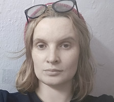

Привет! 

Я междисциплинарная художница, куратор и исследовательница из Нижнего Новгорода, в настоящее время живу в Санкт-Петербурге.

Как художница я работаю с различными средами — от живописи, видео, инсталляций до поэзии, социальных и кураторских проектов.Так как я получила образование и в области искусства, и в области теоретической физики, в своих проектах я часто совмещаю аналитические методы с традиционными художественными практиками.

Основная область моих интересов —  нестабильные состояния и изменчивые структуры, содержащие парадокс остановки и движения одновременно, которые я исследуюна примере процессов конструирования памяти и идентичности, смещения личных и политических границ,  переопределения форм и функций искусства.

Переосмысление местаи времени действия «выставки» отражены в моих кураторских проектах, существующих в форме кочевых практик и онлайн-платформ.

Основные темы моих  художественныхпроектов—постсоветское пространство, травма, милитаризм, практики архивирования, средства массовой информации, пропаганда. Cпомощью чувственныхметодов и технических приемовя пытаюсьзафиксироватьизменяющиеся следы времени, истории, идентичности, коллективной памяти,аффективных состоянийиопределить характеризующие ихдетерменированные процеcсы.

Образование

2017 – 2019  <a href="http://artesliberales.spbu.ru/?set_language=ru&amp;cl=ru">Кураторские исследования</a>, <a href="http://artesliberales.spbu.ru/?set_language=ru&amp;cl=ru">Смольный факультет свободных искусств и наук</a>, совместная программа СПБГУ и Bard College 
2014               Cовместная образовательная программа "Cabinet of curiosity", KUVA (The Finnish Academy of Fine Arts)  PRO ARTE, Helsinki-Saint-Petersburg

2013 – 2015  <a href="http://proarte.ru/projects/art/">Школа молодого художника</a> фонда Про Арте 
2011 – 2015  <a href="https://ru.wikipedia.org/wiki/Санкт-Петербургское_художественное_училище_имени_Н._К._Рериха">Санкт-Петербургское художественное училище им. Рериха</a>, факультет живописи

2003 – 2008, <a href="http://www.unn.ru">ННГУ им. Лобачевского</a>, <a href="http://www.rf.unn.ru">радиофизический факультет</a> 

Избранные кураторские проекты

cо-куратор<a href="https://garagemca.org/ru/event/faculty-of-elin-m-r-yen-vister-radio-hopes-and-dreams">"Радио мечты и надежды". Московская версия. Давай поговорим о климате, детка!</a>

09 - 10 ноября, 2019

<a href="https://www.nplusonerooms.info">[N+1]rooms</a> 
апрель, 2019 
www.nplusonerooms.info 

<a href="/ru/projects/artgarbage-coop/">ArtGar(b)ageCoop</a> 
апрель, 2018 – настоящее 

<a href="http://www.museum.ru/N69838">Communication Management Unit</a> 
сентябрь 2017 – настоящее,  
Параллельная программа Уральской индустриальной Биеннале

Персональные выставки

 
2019<a href="/ru/projects/sometimes-behave-so-strangely/">Иногда ведет себя так странно</a>, FFTN, Санкт-Петербург

2018<a href="/ru/projects/babushka-s/">Бабушкас</a>,  ДК Розы, Санкт-Петербург

2017<a href="/ru/projects/no-words-no-war/">Нет слов/ нет войны</a>,  Каринарника, Словения

2016<a href="/ru/projects/somethingnew/">Что-то новое</a>,  FFTN Gallery,Санкт-Петербург

2016<a href="/ru/projects/the-decay-time-of-mettastable-state/">Время распада метастабильных состояний</a>,  лаборадория Интимное место, Санкт-Петербург

Групповые выставки

2019

8-10 ноября, cо-курирование двухдневного радио <a href="https://garagemca.org/ru/event/faculty-of-elin-m-r-yen-vister-radio-hopes-and-dreams">"Мечты и надежды", Московская версия</a>, музей Гараж, Москва

3,4,16,17 октября, <a href="/ru/projects/on-line/">перформанс "On line"</a>для выставки <a href="http://kuryokhin.net/impulseexhibition">Импульс</a>, ЦСИ им. Курехина

3-6 октября,  <a href="/ru/projects/you-can-touch-it/">Вы можете это потрогать</a>, зины Бабушкас, "Путешествие на Большой Север в поисках кратера Другой Розы 
по компасу ЛибреЛуч", ДК Розы, Санкт-Петербург

4,5,6, октября -  программа открытых студий, <a href="http://curatorialforum.art">Кураторский форум</a>, Санкт-Петербург

июль, <a href="/ru/projects/heaven/">Рай</a>, Gamma Festival, Санкт-Петербург

апрель,  <a href="/ru/projects/academy/">Академия</a>, Левелс, Завод им. Степана Разина, Санкт-Петербург

февраль - март, <a href="/ru/projects/no-words-no-war/">Нет слов/нет войны,</a> Периферический взгляд, Trieste, Italy 

2018

7-е октября, <a href="/ru/texts/information/">Информационное,</a>   Failed, Agile Gallery, Санкт-Петербург

октябрь - ноябрь, <a href="/ru/projects/figuresmillion/">Миллион</a>, Вербатим, выставка Тихие голоса, Красноярский центр искусств, Красноярск

22 сентябрь, <a href="/ru/projects/babushka-s/">Бабушкас</a>, фестиваль уличного искусства "Арт Проспект", Санкт-Петербург

6-10 сентябрь, презентация <a href="/ru/projects/communication-management-unit/">CMU</a>, Lofoten Sound Art Symposium, Норвегия

июнь, <a href="/ru/projects/rooms-1/">Комнаты</a>, Пространствование, Quartariata Residency, Санкт-Петербург

31 май - 3 июня, <a href="/ru/projects/rooms/">Технологии присутствия,</a> фестиваль Убежище, Хельсинки, Финляндия

май - июнь, <a href="/ru/projects/you-can-touch-it/">Вы можете это потрогать</a>, Слепки, Музей Академии Художеств им Репина, Санкт-Петербург

май - июнь, <a href="/ru/projects/behing-the/">Над вечным покоем</a>,  Частная жизнь радиочастот, Музей радио, Санкт-Петербург

апрель, <a href="/ru/projects/dialog/">Диалог</a>, Социальные медиа - привычка к совместности, Музей радио, Санкт-Петербург

январь - present, <a href="/ru/projects/the-google-it/">Thegoogleit</a>, web выставка 

2017

декабрь,  <a href="/ru/projects/track-track/">The End,</a> "Track 2 Track",  Quartariata Residency,  финальная выставка лаборатории экспериментальной поэзии

сентябрь, <a href="/ru/projects/you-can-touch-it/">Вы можете это потрогать,</a> Письма в будущее, ДК Розы, Санкт-Петербург

сентябрь, <a href="/ru/projects/the-blue-serie/">Синяя серия</a>, выставка Настоящая небыль, 14-ый фестиваль “Современное искусство в традиционном музее”, Санкт-Петербург

cентябрь, <a href="/ru/projects/figuresmillion/">Миллион</a>, <a href="/ru/projects/verbatim-1/">Вербатим</a>, выставка Тихие голоса, Петропавловская крепость, Санкт-Петербург

февраль, <a href="/ru/projects/the-blue-serie/">Синяя серия</a>, 900 and another 25,000 days, Новый музей, Санкт-Петербург

2016

июль, <a href="/ru/projects/no-words-no-war/">Нет слов/ нет войны</a>, Глубоко внутри, Московская молодежная биеннале, Москва

апрель, <a href="/ru/projects/no-words-no-war/">Нет слов/ нет войны,</a> выставка What we left behind in Russia?, часть проекта “Beside war", Redipuglia Fogliano, Италия

2015

ноябрь,<a href="/ru/projects/daily-news/">Новости Луганска,</a>Мультимедиа фестиваль,  Красноярск, Россия

октябрь, <a href="/ru/projects/daily-news/">Новости Луганска,</a> Leaving Tomorrow, финальная выставка проекта Старт, Винзавод, Москва, Russia

октябрь, <a href="/ru/projects/figuresmillion/">Миллион</a>, 900 and another 25,000 days, Kunstverein, Hamburg, Germany

октябрь,<a href="/ru/projects/daily-news/">Новости Луганска</a>,“Внимание!!” multimedia art festival, Lvov, Ukraine

май, <a href="/ru/projects/planets/">Open:spaces,</a> Звездный городок, выпускная выставка студентов Школы молодого художника фонда Про Арте, Новый музей, Санкт-Петербург, Россия

май, <a href="/ru/projects/cover/">Ковер</a>,   "24h" Corner Space, Helsinki

апрель, <a href="/ru/projects/no-words-no-war/">Нет слов/ нет войны</a>, выставка Военный музей, ММСИ, Москва

2014

сентябрь, интерактивная скульптура <a href="/ru/projects/cube-not-cube/">Куб не куб,</a>  фестиваль паблик-арт "Арт проспект", Санкт-Петербург, Россия

июль, Последние открытия, Москва, ЦСИ Сокол, специальная программа Московской биеннале молодого искусства

июнь,<a href="/ru/projects/daily-news/">НовостиЛуганска,</a>  видео-показ,  фонд Про Арте, Санкт-Петербург, Россия

2013

декабрь, <a href="/ru/projects/under-ground/">Подземка</a>,  "В чем суть?", фонд Про Арте, Санкт-Петербург, Россия

Коллекции

<a href="/ru/projects/no-words-no-war/">Проект "Ни слова о войне"</a>  передан в коллекцию <a href="https://www.iodeposito.org/en/">IoDeposito</a>

Достижения

2020  Лонг-лист премии Курехина в номинации "Лучший медиа-объект"

2019  Специальный приз конкурса кураторских проектов «Вызов» в составе кураторской группы ArtFog за проект Ghostpitality 
2016  Communication Management Unit, шорт-лист Brewhouse Art Prize, категория “эксперимент”, Россия

2015  Победитель Красноярского мульти-медиа фестиваля, Красноярск, Россия

Лекции и публичные выступления

10.11.2017 “Презентация Communication management unit” – IV Уральская Индустриальная Биеннале Industrial Biennale, Екатеринбург 
17.02.2018 “Искусство вформате онлайн-платформ“ – публичная лекция фестиваля “Пространствование”,  QuartaRiata, Петергоф

06.03.2018  <a href="http://manege.spb.ru/events/vstrecha-molodyh-spetsialistov-hudozhniki-akademii-hudozhestv-i-kuratory-fakulteta-svobodnyh-iskusstv-i-nauk-spbgu/">встреча "кураторов" и "художников"</a> в рамках выставки "Преодоление", Манеж, Санкт-Петербург

06.05.2018, "Искусство в  формате онлайн-платформ", лекция для выставки "Человеческое/нечеловеское",QuartaRiata, Петергоф

3-5.08.2018 "Расти и гний!", Эко-фестиваль в Narva-Joesuu, презентация проекта ArtGarg(b)ageCoop

25.11.2018 "Педагогические проекты как художественная практика", ДК Розы, Санкт-Петербург

04-06.10.2019 Artist Talk в рамках Open-studios Кураторский форум, Санкт-Петербург

23.11.2019 участие в круглом столе конференции “Цифровое и человеческое”, доклад на тему “Политическое тело в цифровом человеческом пространстве”

23.11.2019 Artist Talk в студии 4413 для студентов школы “Пайдейя”

06.12.2019 Участие в конференции "Дар и Труд в искусстве и культуре", ДК Розы, Санкт-Петербург

Тексты

октябрь 2018 - present - телеграм-канал <a href="https://t.me/procartistination">procartistination</a>

<a href="http://aroundart.org/2020/04/13/otkrytia_okyabr-fevral/?fbclid=IwAR3GQvSkijnYA__IAimlSw50eiYWvn-SNxs12V2K1-U0aP311B9wU855iaY">Открытия недели</a><a href="http://aroundart.org/2020/04/13/otkrytia_okyabr-fevral/?fbclid=IwAR3GQvSkijnYA__IAimlSw50eiYWvn-SNxs12V2K1-U0aP311B9wU855iaY">для</a><a href="http://aroundart.org/2020/04/13/otkrytia_okyabr-fevral/?fbclid=IwAR3GQvSkijnYA__IAimlSw50eiYWvn-SNxs12V2K1-U0aP311B9wU855iaY">aroundart.org</a>

<a href="https://syg.ma/@natalia-tikhonova/onlain-platformy-kak-ghibridnyie-formy-vystavok-vstuplieniie-pro-uslovnost">Онлайн-платформы как гибридные формы выставок. Вcтупление «Про условность» для syg.ma</a>

<a href="http://aroundart.org/2019/07/21/konteksty-i-chuvstva-v-tsifrovom-prostranstve-beseda-natal-i-tihonovoj-i- mihaila-stepanova/">Контексты и чувства в цифровом пространстве.</a><a href="http://aroundart.org/2019/07/21/konteksty-i-chuvstva-v-tsifrovom-prostranstve-beseda-natal-i-tihonovoj-i- mihaila-stepanova/">Беседа Натальи Тихоновой и Михаила Степанова Первая</a> и <a href="http://aroundart.org/2019/08/18/konteksty-i-chuvstva-v-tsifrovom-prostranstve-chast-vtoraya-beseda-natal-i- tihonovoj-i-mihaila-stepanova/">Вторая частьдля  aroundart.org</a>

