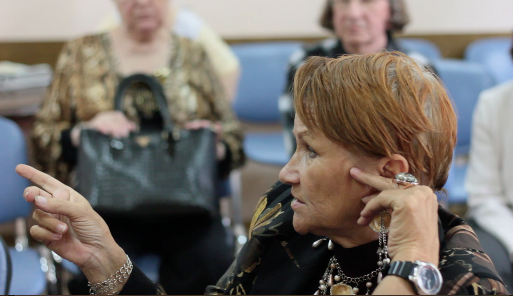
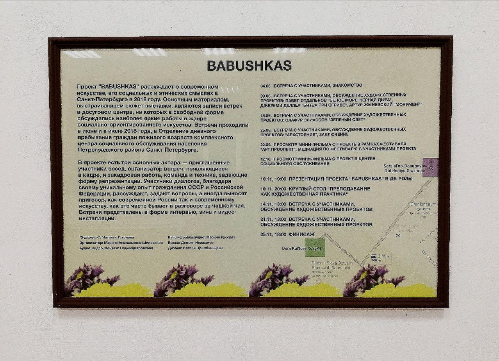
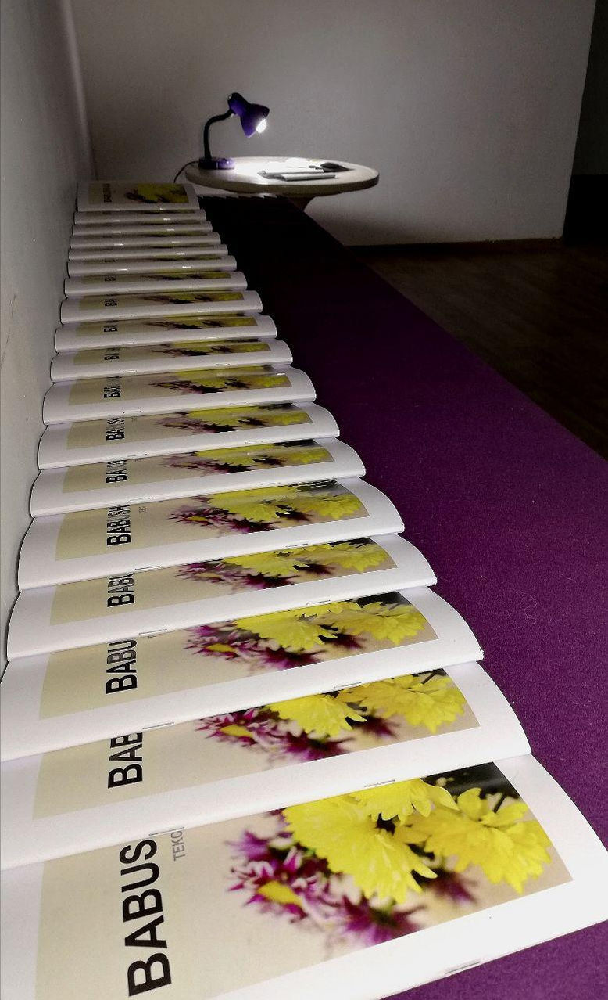

Мероприятия проекта

04.06.2018   встреча с участниками, знакомство 
09.06.2018   встреча с участниками, обсуждение художественных проектов: Павел Отдельнов "Белое море, черная дыра", Джереми Деллер "Битва при Огриве", Артур Жмиевский "Монумент" 
18.06.2018   встреча с участниками, обсуждение художественных проектов: Олафур Элиассон "Зеленый свет" 
25.06.2018   встреча с участниками, обсуждение художественный проектов: "Архстояние", заключение 
22.09.2018   просмотр мини-фильма о проекте в рамках фестиваля "Арт Проспект", медиация по фестивалю с участниками проекта 
12.10.2018   просмотр мини-фильма о проект в центра социального обслуживания.  
10.11.2018   открытие проекта "Бабушкас" в ДК Розы 
10.11.2018   круглый стол "Преподавание как художественная практика" в ДК Розы 
14.11.2018   встреча с участниками, обсуждение художественных проектов в ДК Розы 
21.11.2018   встреча с участниками,  лекция на тему "Преподавание как художественная практика", обсуждение художественных проектов в ДК Розы 
25.11.2018   финисаж выставки в ДК Розы

<h6>Встречи в социальной центре на Чкаловской проспекте</h6>

<h6>09.06.2018 - 25.07.2018</h6>

<h6><a href="https://www.artprospect.org/fullscreen-page/comp-jlkxdcvj/e328093e-9c9a-4126-b64b-8cf7d15a16da/11/%3Fi%3D11%26p%3Djv0xb%26s%3Dstyle-jlkxdcvn?fbclid=IwAR0l82Wcpu1BjxHiDPmXfem8FYHcmiwEJ9Q-FbLOC0OFlF9r5EyHWCTLEwA">https://www.artprospect.org/fullscreen-page/comp-jlkxdcvj/e328093e-9c9a-4126-b64b-8cf7d15a16da/11/%3Fi%3D11%26p%3Djv0xb%26s%3Dstyle-jlkxdcvn?fbclid=IwAR0l82Wcpu1BjxHiDPmXfem8FYHcmiwEJ9Q-FbLOC0OFlF9r5EyHWCTLEwA</a></h6>

<h6>Показ на фестивале Арт Проспект</h6>

<h6>23.09.2018</h6>

<h6>Выставка-презентация в ДК Розы</h6>

<h6>09.11.2018 - 25.11.2018</h6>

<h6>Видео с презентации в ДК Розы</h6>

<h6>10.11.2018</h6>

<h6><a href="https://www.facebook.com/events/559154391175612/?active_tab=about">https://www.facebook.com/events/559154391175612/?active_tab=about</a></h6>

Отрывок из "Записка Отдела культуры ЦК КПСС «О некоторых вопросах развития современной советской литературы», 27 июля 1956 г

<a href="http://www.doc20vek.ru/node/1601?fbclid=IwAR284XbAvIG3dt00k0_Vl119G3826r9h4-poiXcDfNicsLIynsZ0fLdlkWc">http://www.doc20vek.ru/node/1601?fbclid=IwAR284XbAvIG3dt00k0_Vl119G3826r9h4-poiXcDfNicsLIynsZ0fLdlkWc</a>

"Решения ХХ съезда КПСС открывают перед писателями широчайшие перспективы развития страны, прогресса во всех областях жизни народа. Решения съезда с глубоким удовлетворением восприняты массой литераторов. Писатели единодушно признали справедливой критику недостатков современной литературы в отчетном докладе ЦК КПСС. С особой остротой стоит сейчас перед писателями вопрос об изучении жизни, о том, как сочетать актуальность и подлинную художественность в произведениях искусства. Есть специфические трудности, которые возникают перед советскими художниками и которых не знали писатели прошлого. Нашим художникам приходится отображать новый, невиданный раньше мир, противоречия которого проявляются в более сложных формах и не так обнажены, как социальные контрасты классового общества. 
Одна из коренных причин отставания нашей литературы и состоит в отрыве значительной части писателей от жизни народа, в том, что они замкнулись в рамках узко литературного быта и появляются в семьях рабочих и колхозников только как наблюдатели, собирающие в порядке «творческой командировки» материал для будущей книги. Гастрольное «изучение жизни» во время кратковременных выездов не может дать писателям подлинных знаний о жизни, о думах и чаяниях народа. Именно от плохого знания жизни возникают различные «шараханья», отражающие неуверенность в мыслях и убеждениях."

Отрывок из расшифровки встречи, обсуждение проекта "Битва при Огриве" Джереми Деллера:

.... 
Из зала: 
– А вот смотрите, здесь чёрно-белые фотографии — они один в один повторяют эти фотографии. 
– А реальные? Чёрно белые, да? 
– Реальность чёрно-белая. 
– Я вообще не понимаю. 
– Это не искусство, это просто реконструкция! 
– Любая реконструкция — это спектакль, а спектакль — это вид театрального искусства. 
– Почему не искусство, обязательно искусство! 
– Это тоже искусство. Искусство многогранно! 
– И фотография, и действо всё это. 
– Но она у вас вызывает какое-то эстетическое, внутри, вызывает у вас какие-то чувства? Вот у меня, например, нет. 
– Никаких! 
– Абсолютно! 
– Основные чувства здесь должно было вызвать у тех — у участников, у потомков этих событий, которые там участвовали! 
– Но какие-то эмоции вызывает, вот повтор этот? 
– Если бы мой сын там участвовал, я бы очень беспокоилась. Однозначно. 
– Если бы вы участвовали, у вас было бы очень много эмоций. 
– Я бы не пустила… 
– Вот когда вы приходите на спектакль, он вызывает эмоции у тех, кто это смотрит. 
– Вот я в Эрарту иногда хожу: очень интересные есть работы, очень интересные — фотографов ... 
– Так и тут. Те, которые участвовали в этом и видели вживую, у них это вызывало... 
– Но в основном, никакого удовольствия не получаешь в этом. Так, посмотрел, и пошёл. 
– Массу эмоций. 
– Но осталось-то — вот! Что-то должно остаться! Остались только фотографии! 
– Хорошо, а что от театральной постановки остаётся? Вот прошёл спектакль, зрители посмотрели — что осталось? 
– Декорации, фотографии, отзывы в газетах, статьи… 
– Ну там декорации остались, и здесь декорации остались. Но по декорациям мы же не можем сказать, насколько удачный был спектакль. И так в принципе и тут. 
– Это событие здесь отражено. Событие того времени. 
– Раньше была музыка подобным искусством, это сейчас стали звукозаписывающие аппараты, возможность музыку записать и воспроизвести. А ведь раньше, сколько веков, музыку создавали, играли — и вот пока слушают, она звучит. А потом, музыка отзвучала — и всё, и … 
– Остались ноты, по которым можно снова сесть и … 
– А сколько веков музыка была без нот! 
...

Проект "Babushkas"рассуждает о современном искусстве, его социальных и этических смыслах в Санкт- Петербурге в 2018 году. Основным материалом, формирующим сюжет выставки, являются записи встреч в досуговом центре, на которых в свободной форме обсуждались наиболее яркие работы в жанре социально-ориентированного искусства. Встречи проходили в раз в неделю в июне и в июле 2018 года. Заверщающей экспозицией стала выставка в пространстве ДК Розы, на которой была представлена видео-инсталляция состоящая из 3-х экранов с дискуссией, видео-интервью участников, зины с публикацией обсуждения, а также круглый стол и лекции. Участники диалогов, благодаря своему уникальному опыту гражданина СССР и Российской Федерации,  рассуждают, задают вопросы, а иногда выносят приговор, что часто бывает за чашкой чая.

Проект строится на деконструкции парадигмы "искусство как социальный проект", на которой основывался  как соцреализм, так и многие современные проекты, созданные в эпоху "социального поворота", используя  определение Клер Бишоп .

Встречи представлены в форме интервью, зина и видео-инсталляции. Проект "Babushkas", несмотря на то, что основными участниками являются посетители социального центра, отказывается от своей социальной функции в пользу рассуждений о самом себе. Эта инверсия положений позволяет посмотреть на вовлеченность и партисипаторность с другой стороны, и исключить любую возможную в этом случае искусственную отстраненность.

<h6>Исследовательский проект</h6>

<h6>2018</h6>

<h6>текст, видео, многоканальное видео</h6>

<h1>BABUSHKAS</h1>
