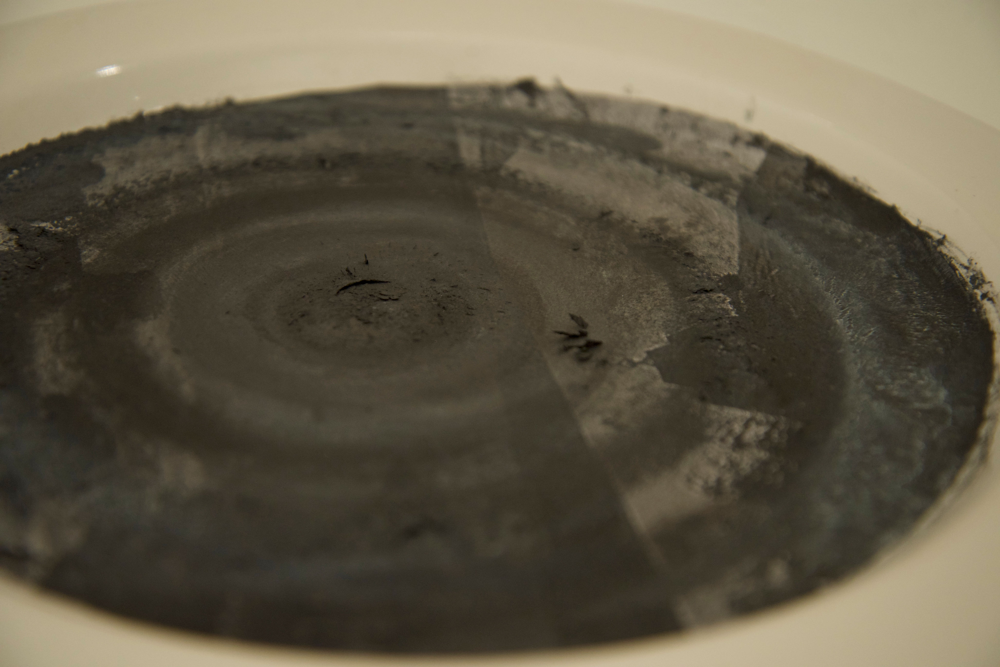
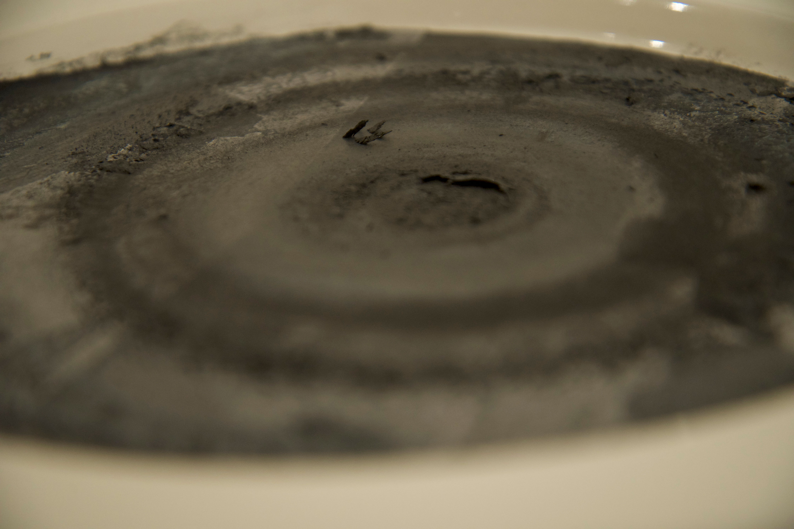

The installation "Above the eternal peace" investigates the instability and non-fixability of medium of painting. The object presents the well known Russian landscapes from one of the most known Russian painter Isaac Levitan. Waves from magnets placed behind of the painting creates subtle movement of material.These oscillations illustrate the continuous changes occurring in any apparent stable system. Continuity and incompleteness is a quality of any living system, and frozen landscapes, even without the artist's intervention, change over time under the influence of external and internal processes.

<h6>Installation</h6>

<h6>2018</h6>

<h6>metallic color, glaces</h6>

<h3>ABOVE</h3>

<h3>THE ETERNAL</h3>

<h3>PEACE</h3>
