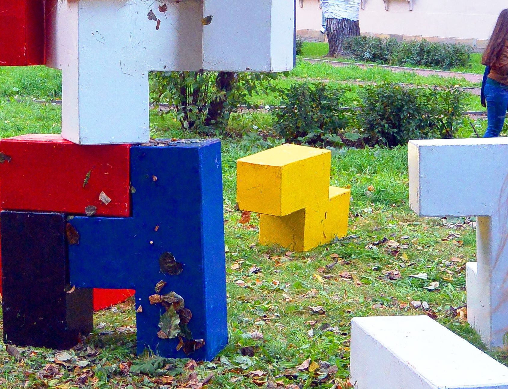
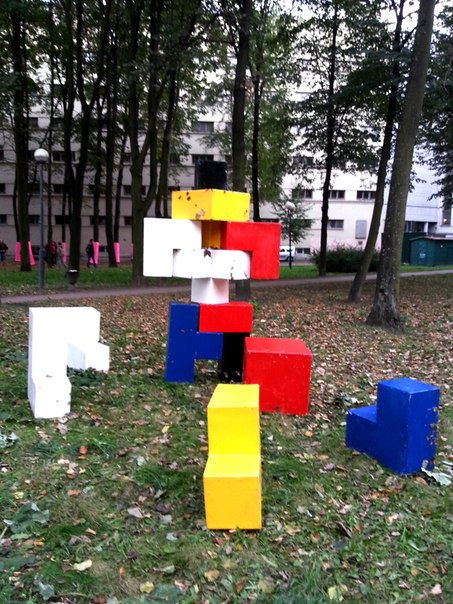
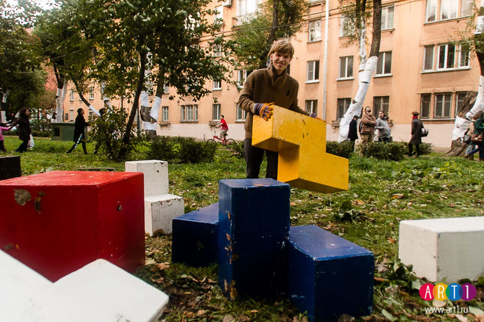

<h1>Скульптура</h1>

<h1>дерево, 120*120, 12 частей</h1>

<h1>2014</h1>

Интерактивная скульптура «Куб не куб» является 3-d пазлом высотой 1 метр 20 сантиметров, состоящем из 12 деталей разнообразной формы,  размера и цвета. При определенной комбинации участник игры может сложить куб, приложив некоторые физические и интеллектуальные усилия, однако заданная форма не является обязательной. По задумке автора, работа должна пробудить в зрителях «внутреннего» художника. Ведь в том случае, если куб сложить не удается, участник невольно становится автором новой скульптурной формы. Таким образом, зритель может сам выбрать - сложить куб, разрешив заданную головоломку, или дать волю фантазии и создать новую абстрактную скульптуру.

Эта игра является аллегорией творчества, художественного процесса, когда настоящим предметом искусства становятся промежуточные, случайные варианты задуманного произведения, рождающиеся при отходе от заданного шаблона.

<h2>КУБ НЕ КУБ</h2>
