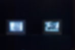
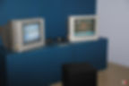
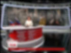

<h6>Инсталляция, два видео</h6>

<h6>1:53, 1:53, звук</h6>

<h6>2014</h6>

Проект «Новости Луганска» посвящен теме освещения вооруженного конфликта на востоке Украины в апреле 2014 года и освещение событий СМИ.

Видео состоит из двух частей – русской и украинской, зеркально отображающих себя. Видео начинается как выпуск новостей, где ведущая на украинском языке рассказывает о событиях в Луганске, после чего следует репортаж. Однако во время репортажа зритель слышит не украинскую речь, а русскую, которая вырвана из новостного ролика, освещающего те же события, но на русском языке. Звук подобран таким образом, что зритель не сразу замечает подмену. Во втором ролике показывается, соответственно, репортаж со стороны русского СМИ с озвучкой от украинской новостной передачи.

Видео деконструирует приемы, которая использует пропаганда, настраивая оптику через терминологию. Одни и те же кадры, с одними и теми же сюжетами, приобретают противоположный контекст, искажающий cмысл событий.

<h6>Документация выставки Leaving Tomorrow,</h6>

<h6>финальная выставка проекта Старт, Винзавод, Москва,</h6>

<h6>октябрь, 2015</h6>

<h6><a href="https://mos-holidays.ru/vystavka-leaving-tomorrow-v-csi-vinzavod/">https://mos-holidays.ru/vystavka-leaving-tomorrow-v-csi-vinzavod/</a></h6>

<h6><a href="https://kudamoscow.ru/event/vystavka-leaving-tomorrow/">https://kudamoscow.ru/event/vystavka-leaving-tomorrow/</a></h6>

<h6><a href="http://aroundart.org/2015/10/30/leaving-tomorrow/">http://aroundart.org/2015/10/30/leaving-tomorrow/</a></h6>

<h2>НОВОСТИ ЛУГАНСКА</h2>
