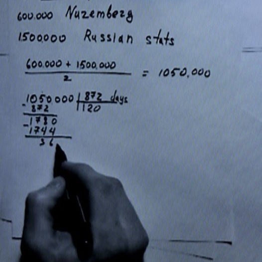
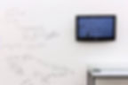
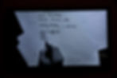
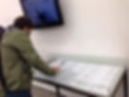
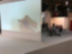
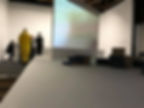
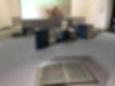

<h6>Видео, инсталляция</h6>

<h6>6:21, без звука</h6>

<h6>2017</h6>

Видео «Миллион» состоит из результатов исследования методов и анализа собственного восприятия блокады Ленинграда. Я ищу способ представить масштаб трагедии в понятных величинах, используя аналитические, технические и визуальные методы. Пытаясь отбросить субъективные ощущения, я обращаюсь к официальным источникам, и останавливаюсь на тексте Нюрнбергского процесса как наиболее полной и распространенной документации последствий Второй мировой войны. Работа с данным материалом усложняется не только его масштабом (весь конспект Нюрнбергского трибунала состоит из 42 томов), но и языковым барьером – текст в полном объеме никогда не был опубликован на русском языке.  
В первом видео и объекте «Миллион» я опираюсь на данные о количестве жертв блокады. Когда мы слышим «один миллион», «двадцать восемь миллионов», «пять тысяч» и т.д., мы не в состоянии связать эти числа с реальной жизнью, реальными людьми. Опираясь на два источника – цифры Нюрнбергского процесса и примерные подсчеты историков, – я пытаюсь перевести миллион человеческих жертв в более понятные величины. Впечатляет не только количество жертв, но и разница в статистических данных из разных источников. Сухой, неживой язык цифр только усиливает эффект обесчеловечивания жертв. Бездушный, антигуманистический подход статистики с округлением и деперсонализацией усиливает эффект отчуждения и деперсонификации.

<h6>Фрагмент видео</h6>

<h6>Документация выставки "900 and another 25,000 days", Kunstverein, Hamburg, Germany</h6>

<h6>2015</h6>

<h6>Документация выставки "Тихие голоса", Красноярский центр искусств, Красноярск</h6>

<h6>2018</h6>

<h1>МИЛЛИОН</h1>
