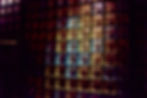
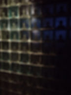
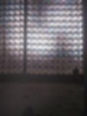
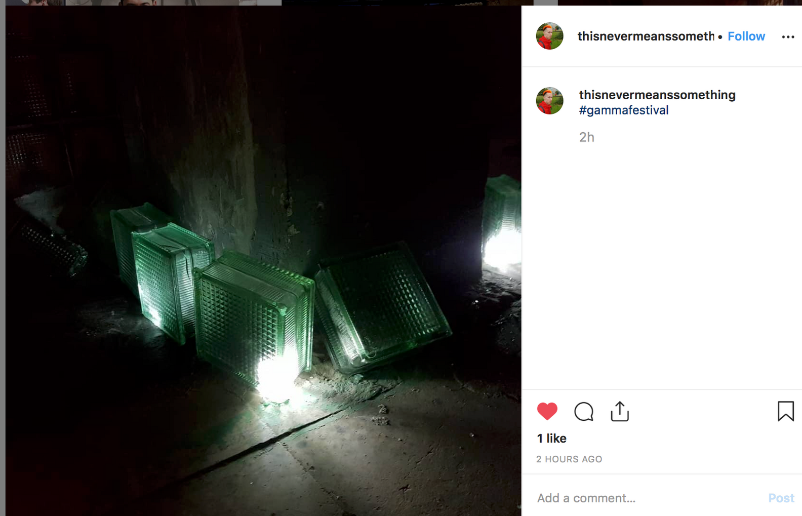
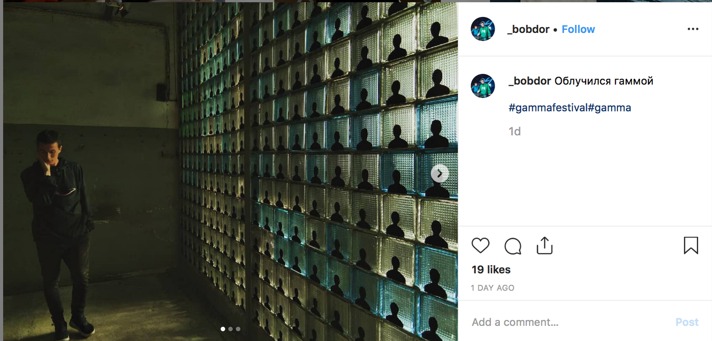

<h6>Тотальная инсталляция</h6>

<h6>10x7 метров</h6>

<h6>стеклоблоки, ламочки, темпера</h6>

<h6>2019</h6>

<h1>Тотальная сайтспецифичная инсталляция "РАЙ" была сделана для бывшего цеха завода Степана Разина по приглашению Гамма Фестиваля, одного из крупнейших музыкальных и техно-фестивалей в Европе.</h1>

<h1>Инсталляция переосмысляет жанр селфи-комнат и является метафорическим высказыванием на тему современного представления о месте бесконечного благоденствия - рае.</h1>

<h1>В традиционных монотеистических религиях описано, что в раю человеку будет предоставлена возможность бесконечного созерцания Господа. С точки зрения современного общества производства контента, рай - это место, где каждый получит своего личного трансцендентного всеобъемлющего созерцателя (наблюдателя, надсмотрщика) и будет бесконечно созерцаем.</h1>

<h1>На стену, составленную из стеклоблоков после реставрации были нанесены боле 500 силуэтов. Также подсвеченные стеклоблоки были расставлены по территории завода. Таким образом стеклоблоки и силуэты людей, попавшие в "рай", оказывались включены в бесконечный поток созерцании через фотографии зрителей и их социальные сети - бесконечно созерцая и будучи созерцаемы.</h1>

<h6>Фотографии из социальных сетей</h6>

<h6>РАЙ</h6>
