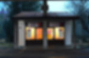
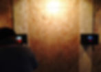
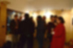
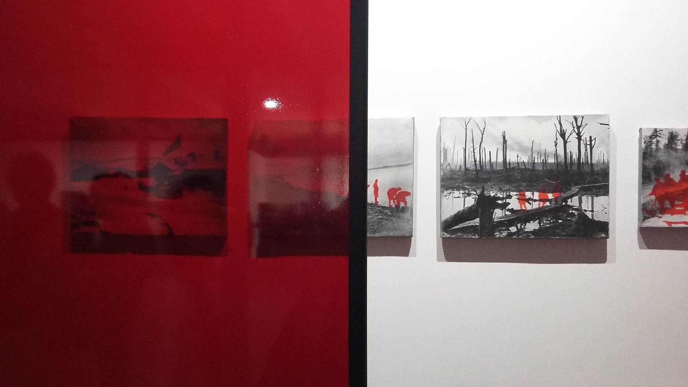
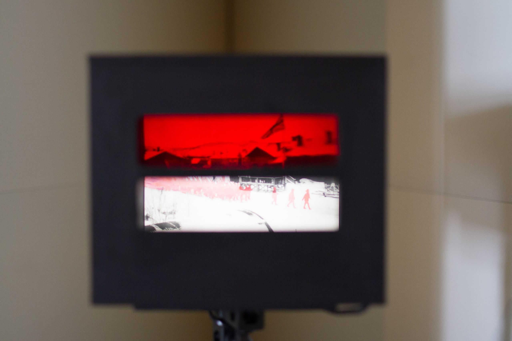

<h6>Инсталляция</h6>

<h6>фотографии 15"20, темпера, стекло</h6>

<h6>2015</h6>

<h6>Документация выставки Глубоко внутри</h6>

<h6>Московская молодежная биеннале, Москва,</h6>

<h6>июль, 2016</h6>

<h2><a href="https://www.rbth.com/arts/2016/07/11/6-exhibits-you-shouldnt-miss-at-the-moscow-biennale-for-young-art_610049">www.rbth.com</a></h2>

<h2><a href="http://aroundart.org/2016/07/28/5-biennale-young-ar/">http://aroundart.org</a></h2>

<h2><a href="https://viennacontemporarymag.com/2016/07/11/moscow-international-biennale-for-young-art-highlights/">https://viennacontemporarymag.com</a></h2>

<h6>Документация выставки вКаринарника,</h6>

<h6>Словения</h6>

<h6>февраль, 2017</h6>

<h6><a href="http://www.worldwarone.it/2017/02/no-words-no-war-poli-focal-interactive.html">http://www.worldwarone.it</a></h6>

<h6><a href="https://www.artribune.com/mostre-evento-arte/natalia-tikhonova-no-words-no-war/">https://www.artribune.com</a></h6>

<h6><a href="https://photos.edu.pl/media/BQqekwagVVS-the-opening-of-the-exhibition-no-wordsno-war-by-n.html">https://photos.edu.pl</a></h6>

Проект «Ни слова о войне» состоит из серии фотографий, на которые автор предлагает посмотреть через светофильтры.

Через обычное стекло зритель видит оригинальное фото, видоизмененное автором: солдаты и следы войны на черно-белых фотографиях закрашены красным цветом. При просмотре фотографий через светофильтр красное исчезает. С холодной отстраненностью и объективностью, присущей законам физики, автор анализирует свойства человеческой памяти и её реакции на такое травматическое событие как  война. В восприятии человека извне война – это всегда что-то эфемерное, то, что не происходит в реальной жизни, то, чего нет в «здесь и сейчас», будь то война из прошлого, или война сегодняшняя. Память и воображение работают выборочно, представляя образы и штампы,  что помогает деперсонализировать свидетельства войны.

<h2>НИ СЛОВА О ВОЙНЕ</h2>
