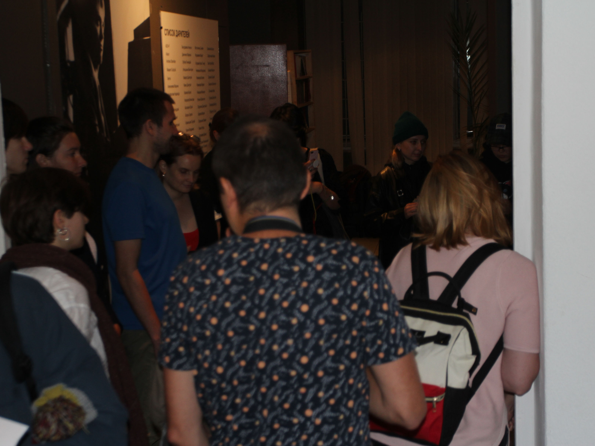
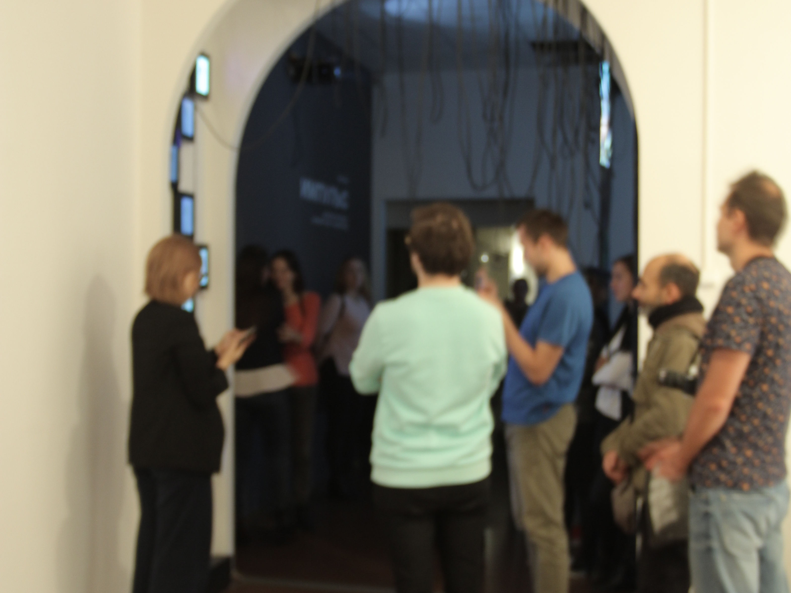
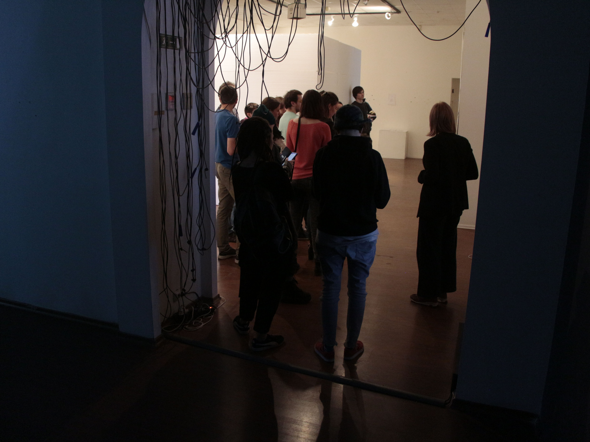
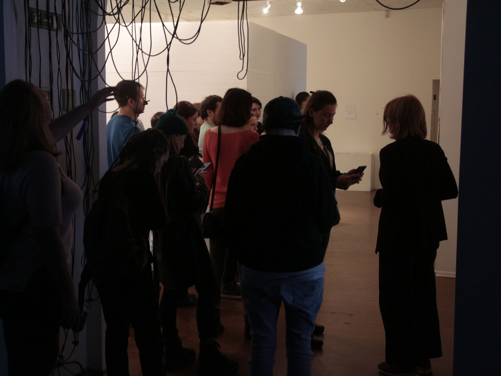
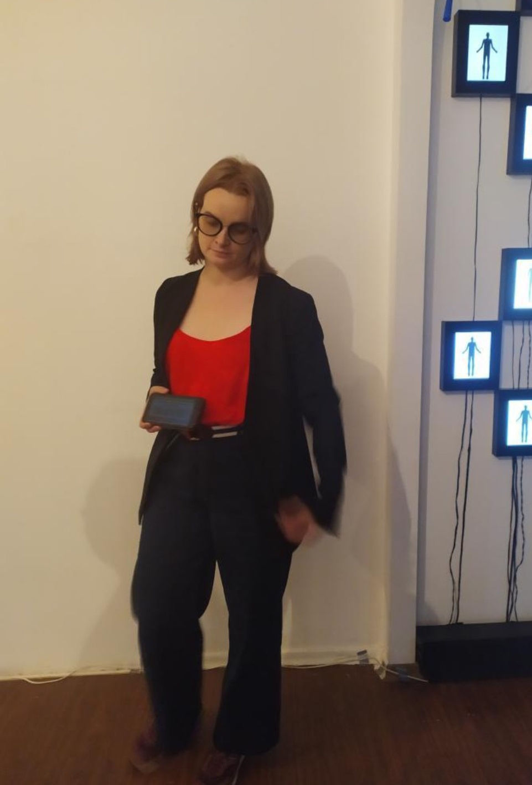
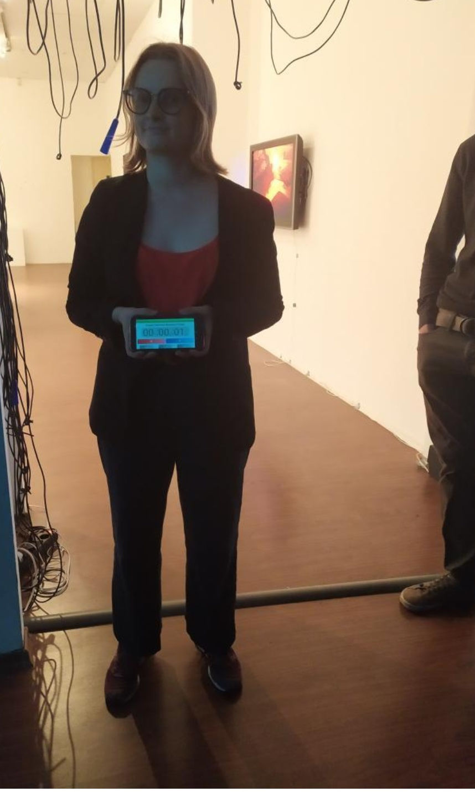
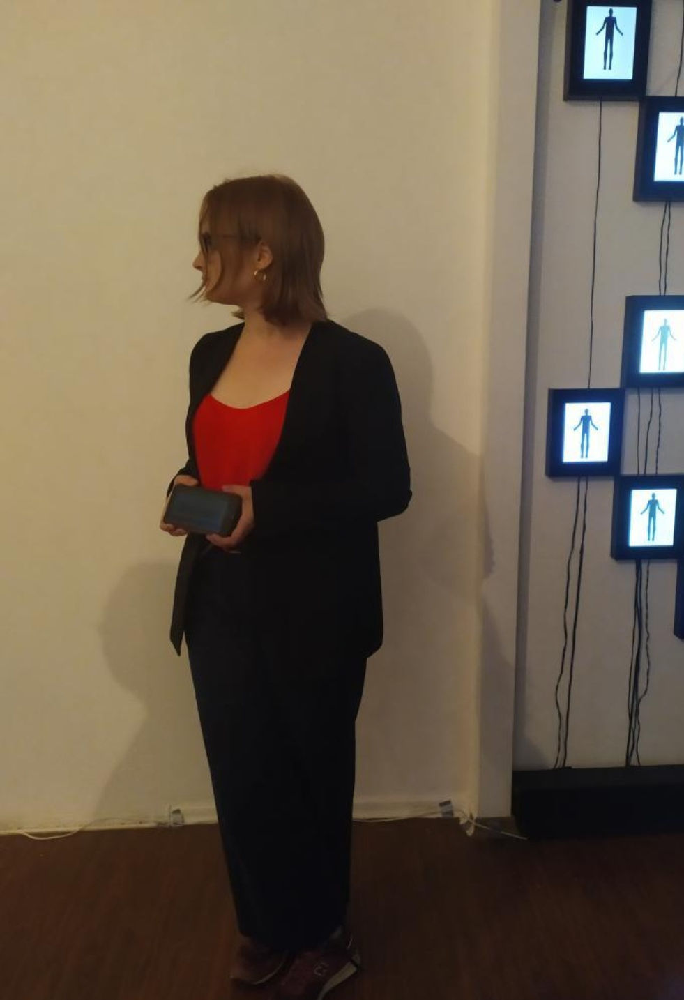
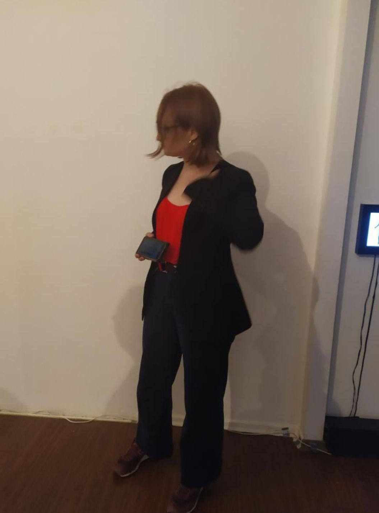

<h6>Performance</h6>

<h6>45:00</h6>

<h6>2019</h6>

<h1>Performance mediation "On line"presents the exhibition as a line divided into segments measured by a timer. The seconds and minutes allotted for viewing  exhibition are used instead of text or explication, and they set the focus of the audience and frame the  interpretation.Video, installations and objects are being turned into a performance that unfolds on the timeline.</h1>

<h1>Documentation of performance onImpulseexhibition made by Veronika Nikiforova</h1>

<h1>Documentation of performance onImpulseexhibition made by Anoton Kvitchuk</h1>

<h6>ON LINE</h6>
