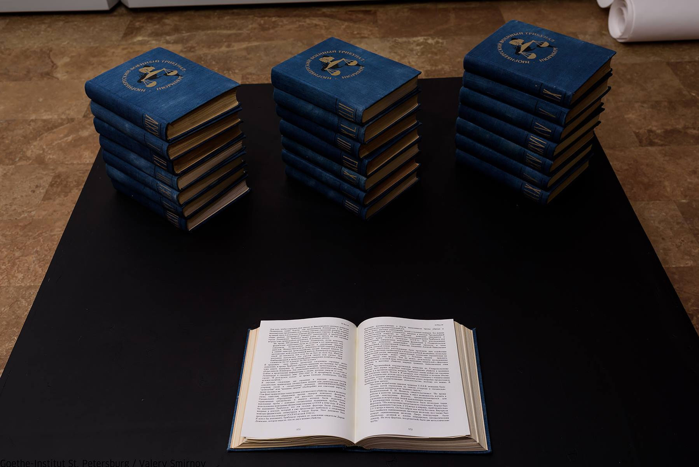
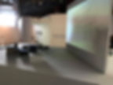
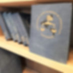
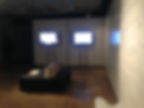
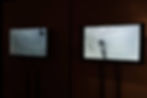
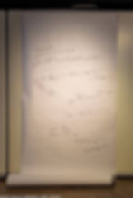

<h6>Installation</h6>

<h6>2018</h6>

<h6>43 books, 3 videos with sound, 7:43, 4:34, 6:43</h6>

<h6>Upcoming research project in social media</h6>

<h6>Video documentation of performance</h6>

<h6>Documentation of the exhibition "Silent voices"</h6>

<h6>The Krasnoyarsk Museum Center,  Krasnoyarsk</h6>

<h6>October - November, 2018</h6>

<h6>Documentation of exhibition "True Fiction"</h6>

<h6>The 14th Contemporary Art in the Traditional Museum Festival</h6>

<h6>Saint Petersburg</h6>

<h6>September, 2017</h6>

<h6><a href="http://www.polithistory.ru/museum/news/view.php?id=4548">http://www.polithistory.ru/museum/news/view.php?id=4548</a></h6>

<h6>Documentation of exhibition  "900 and another 25,000 days"</h6>

<h6>New museum, Saint Petersburg</h6>

<h6>February, 2017</h6>

<h1>"The blue series" project  consist of experiments and studies built around the text of the Nuremberg process. It tries to translate millions into units, years into minutes, and tragedy into the format of the exhibition. The installation includes models of the Nuremberg trials in Russian which have never existed. The models of books are supplemented with video of research based on text. The first experiment shows the attempts to calculate victims of the blockade of Lenigrad  by hand. Starting work with figures from manual calculations, I come to the nowadays technical possibilities. I run books through programs - word search, text-to-speach. The program selects pages related to Leningrad, selects only  numbers, creates audio recordings that can be heard in the car.Total volume of materials exceeds 200 hours. Reconciling with my own limitations, I assign the function of analysis and acceptance to the computer, I give him the opportunity to "say" what remains unsaid. The slender logic of a machine or mathematics enhances the effect of the meaninglessness and inhumanity of war. Experiments and research form a series of meaningless actions. The purpose of experiments is egocentric. They do not lead to any conclusions or results.   With the  sense of guilt for my limitations, I go into a world of logic and numbers that should help me to understand and accept the scale of the tragedy, and make it to become happened.</h1>

<h1>THE BLUE SERIES</h1>
