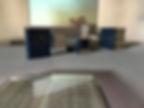

<h6>Инсталляция</h6>

<h6>43 книги, 3 видео со звуком, 7:43, 4:34, 6:43</h6>

<h6>Эксперимент в социальной сети</h6>

<h6>2017</h6>

<h6>Видео-документация</h6>

<h6>Документация выставки Настоящая небыль,</h6>

<h6>14-ый фестиваль “Современное искусство в традиционном музее”, Санкт-Петербург</h6>

<h6>февраль, 2017</h6>

<h6><a href="https://kudago.com/spb/event/vyistavka-nastoyaschaya-nebyil/">https://kudago.com</a></h6>

<h6><a href="https://www.dp.ru/a/2017/09/28/Nastojashhaja_nebil">https://www.dp.ru</a></h6>

<h6><a href="http://www.proarte.ru/events/nastoyashchaya-nebyl-vystavka-vypusknikov-programmy-shkola-molodogo-khudozhnika-fonda-pro-arte-v-ram/">http://www.proarte.ru</a></h6>

<h6>Документация выставки 900 and another 25,000 days, Новый музей, Санкт-Петербург</h6>

<h6>Документация выставки Тихие голоса, Красноярский центр искусств, Красноярск</h6>

<h6><a href="http://www.museum.ru/N71074">http://www.museum.ru/N71074</a></h6>

<h6><a href="https://www.redomm.ru/afisha/info/11938/">https://www.redomm.ru/afisha/info/11938/</a></h6>

<h6><a href="http://mira1.ru/event/678?special=1">http://mira1.ru/event/678?special=1</a></h6>

Сегодня технологии Big data, позволяющие анализировать огромные массивы данных, участвуют в формировании не только будущего, но ипрошлого. Работают ли технологии в случае, когда человек сталкивается с такими масштабными событиями как война, травма иколлективная память? Этот вопрос я пытаюсь задать в проекте «Голубая серия».  “The blue series” это 42 тома стенографии Нюрнбергскогопроцесса, опубликованные на английском  языке. Изучая текст с помощью программ для обработки текста, проект выстраивает егонелинейный нарратив. Примиряясь с собственной ограниченностью, я пытаюсь описать события с помощью цифр, и возлагаю функциюанализа и принятия на технологию.

С помощью программ «Text to speech» я пытаюсь соизмерить текст процесса с ритмом повседневности, привести его в соразмерныймасштабу жизни или выставки формат. Цифры деперсонифицируют текст и создают иллюзию понимания и анализа. Результатыэкспериментов представлены  в видео.

В рамках проекта были созданы никогда не существующие макеты книг на русском языке, имеющие конкретную силу воздействия  вес. Спомощью социальных сетей  я предлагаю поучаствовать в эксперименте и стать хранителем книги. Таким образом, макеты книг становятсяповодом и темой для общения, встреч. Эксперимент по совместному хранению книг является метафорой переживания коллективнойпамяти, и создает смежные области памяти и воспоминаний.

Последним этапом исследования становится «читальный зал» и сайт, где пустые макеты книг наполняются текстом

<h1>СИНЯЯ СЕРИЯ</h1>
