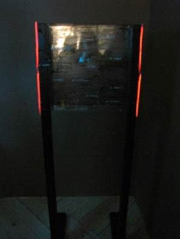
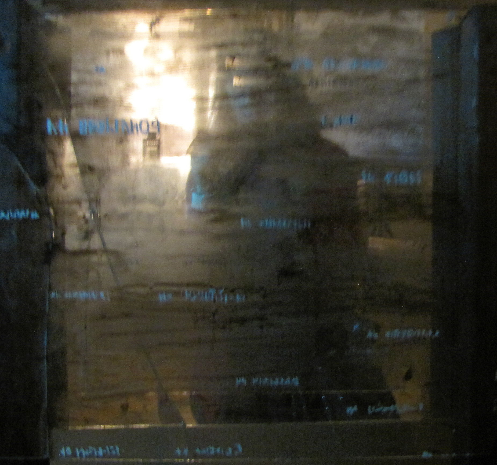
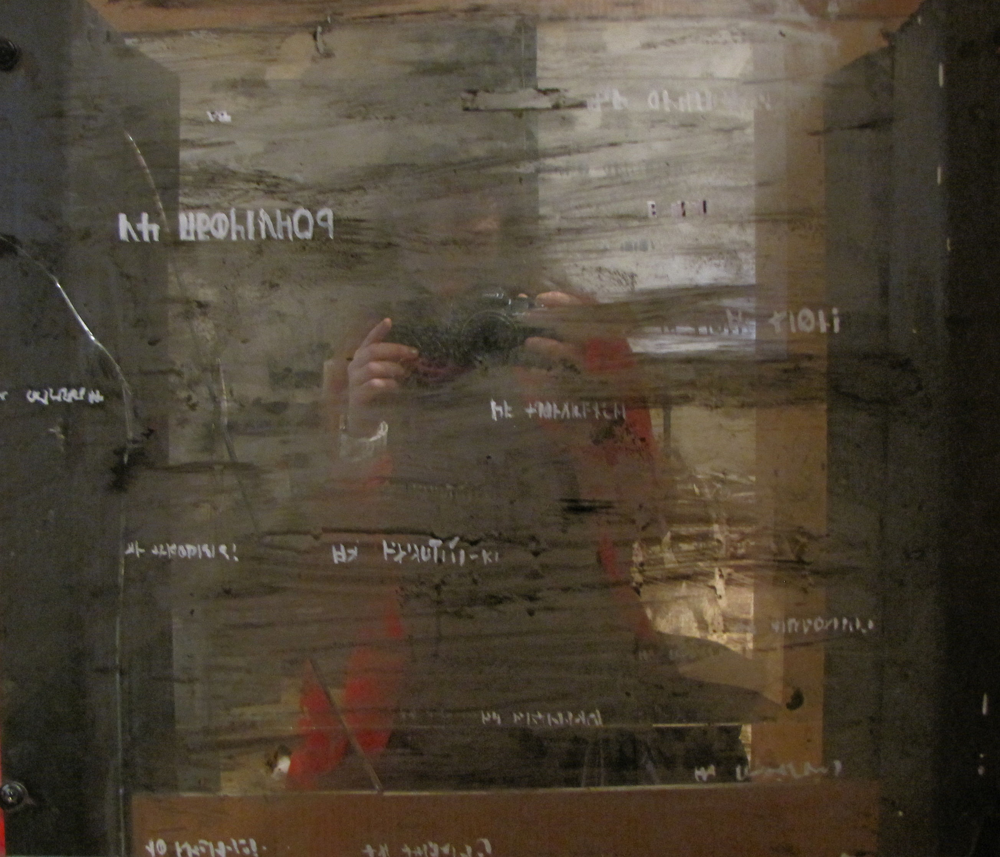

<h6>Sculpture</h6>

<h6>wood, glaces, mirrors, tempera</h6>

<h6>201</h6>

The object consists of mirror and glass in the center of construction. On the glass there are symbols resembling the Cyrillic and Latin letters. Coming to the object the viewer can see reflection through the glass with printed symbols.

This work is about «non-places» described by Marc Auge.

It is "non-place" existing between work and home, when person stands in public transport and immersed himself. At this moment the cloud of words, information, advertising slogans, warnings, illusions prevent or extend the endless dialogue  inside the person.

<h2>UNDERGROUND</h2>
