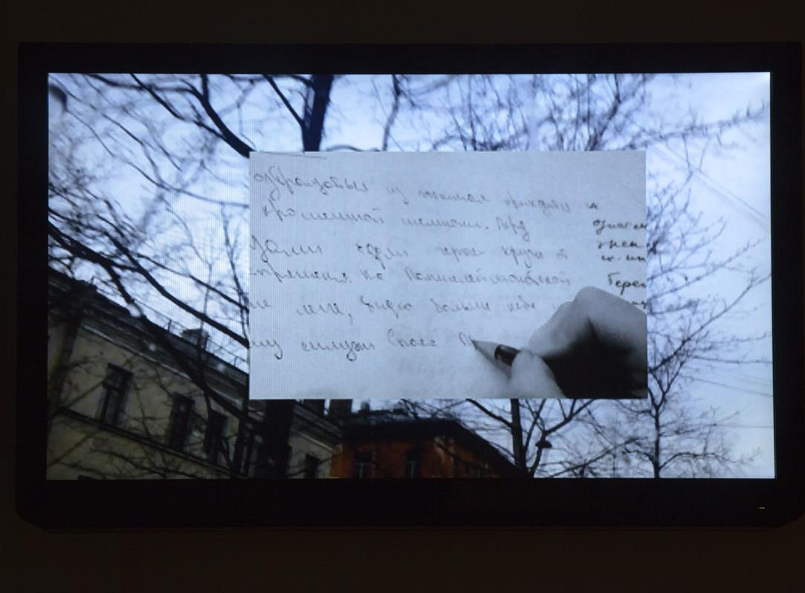
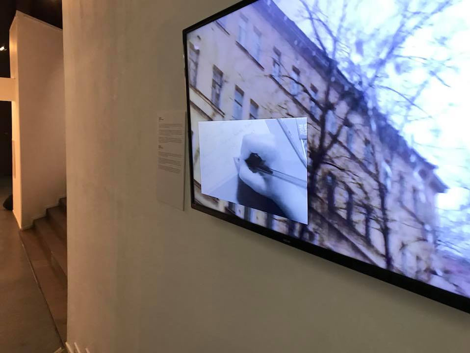

<h6>Видео</h6>

<h6>4:30, no audio</h6>

<h6>2017</h6>

Видео реконструирует  дистанцию между современным жителем Петербурга и жителем блокадного Ленинграда.В видео “Verbatim” кадры из  повседневной  жизни современного жителя Петербурга чередуется с кадрами, в которых мы слышим отрывки из блокадного дневника Любови Шапориной.

Блокадные воспоминания, полные физиологических, жестоких, отталкивающих подробностей о быте перемешиваются с повествованием повседневной жизни автора в формате «один мой день».Желание сократить дистанцию и приблизиться к автору блокадного  дневника определяет уровень откровенности и документальность видео. Изображения  сливаются, накладываются, дополняют, прерывают друг друга, постепенно вытесняются и наслаиваются и переходят в стоп-кадр при чтении дневниковых записей.

Объединяющим и главным «действующим лицом» в видео является город, который хранит в себе память о блокаде и многие  непрочитанные рассказы о ней.

<h2>ВЕРБАТИМ</h2>
