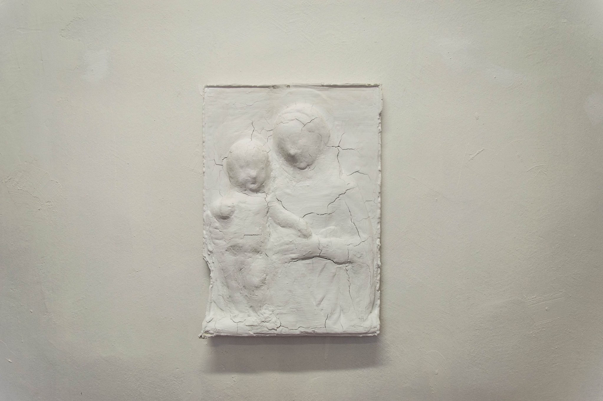
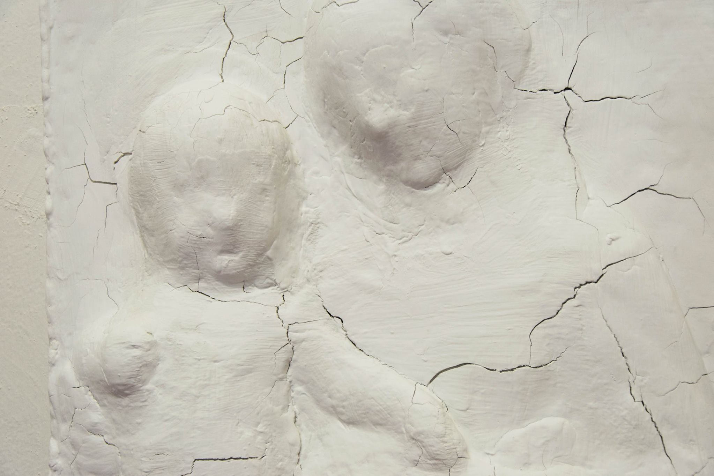

Installation

relief, plaster, video3:42, sound

2017

The installation was created for the project "Letter to the future" presented in Saint Petersburg's House of Rose.

The exhibition was dedicated to "letters to the future" buried and bricked up in 1967.It had two part.The installation consists of video and relief.

The first part presented the relief covered with hundred color's layers literally visualizes the influence of time and tends to create its tactile perception. This formal approach generates images of past existed in today's existence.

The second part of the installation "You can touch it" continues to deconstruct the ratio of past, present and future. A dynamic video represents the process of the relief’s transformation. Using formal approach it recreates the complicated construct of the past in the future.

<h2>Video</h2>

<h2>Excursion through the exhibition</h2>

<h2>YOU CAN TOUCH IT</h2>
