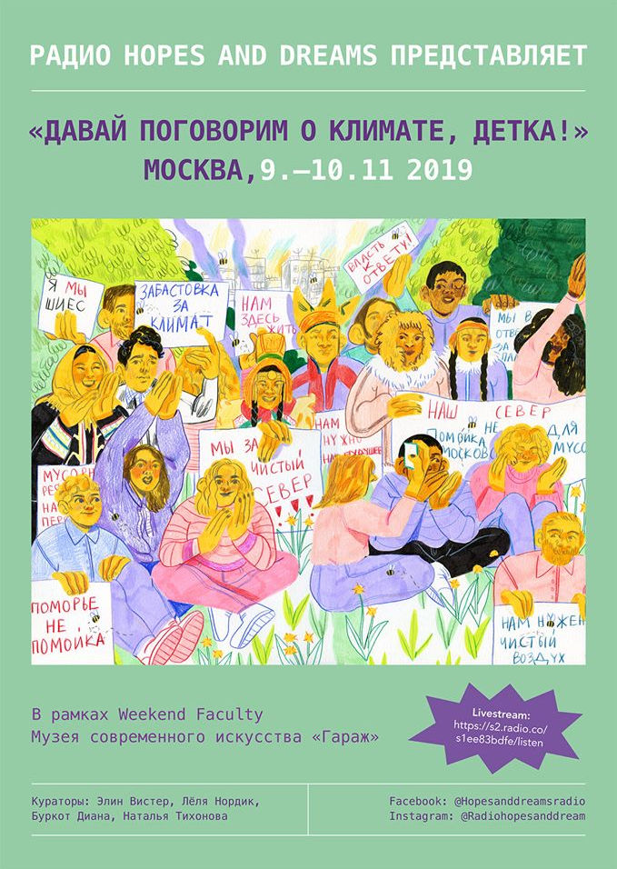

<a href="https://garagemca.org/en/event/faculty-of-elin-m-r-yen-vister-radio-hopes-and-dreams">https://garagemca.org/en/event/faculty-of-elin-m-r-yen-vister-radio-hopes-and-dreams</a>

<a href="https://www.facebook.com/events/431092444424696/">https://www.facebook.com/events/431092444424696/</a>

"Radio Hopes and Dreams– Laboratory for a social just ecological transition, is a mobile, artist-run radio station and laboratory founded by artists Elin Már Øyen Vister (NO) and Margrethe Kolstad Brekke (NO) in 2016. RHAD is an artistic radio concept mixing DIY radio journalism with artistic forms of radio production.

Radio Hopes and Dreams – Let´s Talk about Climate, baby! – The Moscow edition, features Elin Már in close collaboration with Russian artist Diana Burkot, Lölja Nordic, and Natalia Tikhonova as well as a wide range of local participants and contributions from Russian artists. RHAD will rig up a mobile radio station in Garage Museum of Contemporary Art, and co-ordinate all content leading to a two-day radio streaming broadcast. Interviews, conversations, talks, manifestos, poetry, field-recordings, sound-collages, and music, will be the sonic content of the broadcasts

Radio Hopes And Dreams Moscow edition is part of the exhibition <a href="https://thecomingworld.garagemca.org/en">The Coming World: Ecology as the New Politics 2030–2100</a> and will look into local grassroots and artist initiatives in Moscow, St. Petersburg, and the Russian Federation at large and explore local, regional, national, and planetary challenges of the climate crisis and loss of biodiversity; including the situation in the indigenous north.

Radio Hopes and Dreams will <a href="https://s2.radio.co/s1ee83bdfe/listen">stream live</a> Saturday and Sunday 12:00–18:00 and otherwise program throughout the day and night."

<h1>Заголовок 1</h1>
