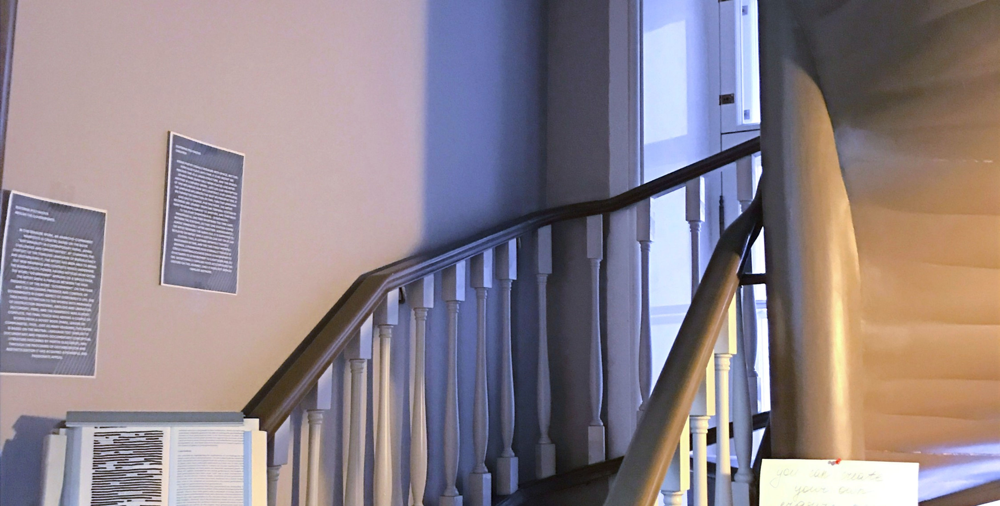
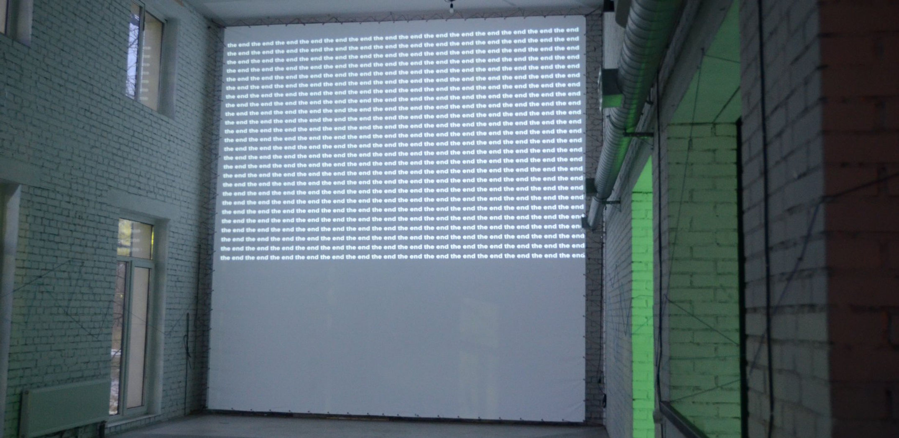
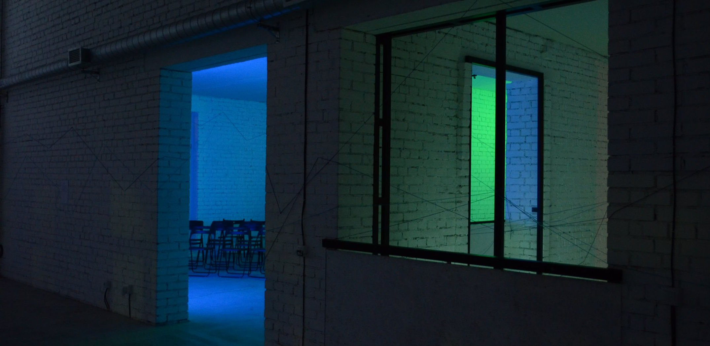

TrackTrack и Track2Track

одновдневные выставки в рамках Лаборатории Экспериментальной Поэзии

Track track - это серия выставок, сделанных в рамках ЛЭП (Лаборатории Экспериментальной Поэзии <a href="https://vk.com/away.php?to=http%3A%2F%2Flanguageartist.me&amp;post=-158313801_8&amp;cc_key=">languageartist.me</a>).

Кураторские проекты TrackTrack работают с альтернативными выставочными пространствами: Tumblr, Google Maps, Twine. Сетевой формат выставок трансформирует способы организации экспозиционного пространства и демократизирует взаимодействие со зрителем.

Track track -  выставка-квест в пространстве Дворца Бобринских.

Выстравка строится по принципу игры, где зрителю предлагается пройти 5 этапов и найти "ключи" к решению поставленной текстовой загадки.

<a href="https://languageartist.me/2017/11/08/track-track-concrete/">Участики выставки</a>

<h4>8 ноября 2017</h4>

<h4>Галерная улица, 58-60, Санкт-Петербург</h4>

Track2track - вторая выставка серии TrackTrack, представляющая собой второй этап "пути", на котором зрителю предстоит исследовать как выставочные объекты, так и следы возможных объектов, ориентируясь по найденным знакам. Track2track - это реконструкция выставки, которой не было, но могла бы быть, а этикетаж - документальное свидетельство этого проекта. Выставка включает несколько блоков: блок звуковой и видеопоэзии, конкретные стихотворения, локальный нарратив, а также специальный блок Imaginary Evidence - презентацию блогов-проектов выставок, осуществленных в виртуальных пространствах.

<h4>17 декабря 2017</h4>

<h4>Quartariata Residency, Санкт-Петербург: Петергоф</h4>

