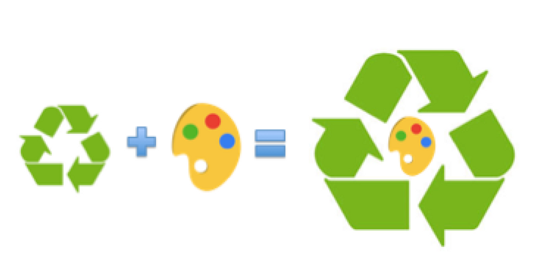

Art Gar(b)age Community is the platform that collect and store garbage left after the exhibitions. Anyone can ask Art Garbage Coop. to provide any things for the exhibitions or personal needs.

Goals

Create platform to decrease the influence of art to environment

Create community and connect people from different areas

Emphasise the of problem pollution

Help artists to organise the exhibitions

Statement

Art area is known as one of the most polluting areas of production. A lot of materials as canvas, papers, construction materials, old equipment are wasted everyday after they are used for the exhibition.  From another side the large amount of young artists and institutions need materials or equipment for their art installations and exhibitions. The organisation “Art Garbage” aims utilise and recycle the materials used for culture events.To make it happen the organisation created database and organised storage spaces. Everyone can contact the organisation and leave or take the materials. The organisation also keeps contact with large institutions to take the materials for recycling. The organisation is consisted of international members and is looking for new members who want to join it and organise the Art Garbage.

