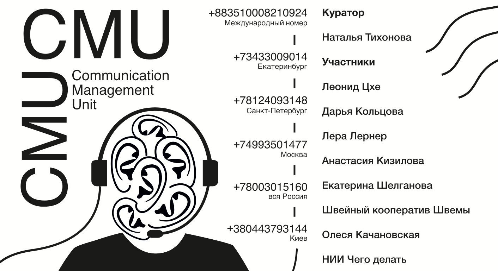

<h2><a href="https://nataliatixo.tumblr.com/post/165407634533/communication-management-unit-intro">COMMUNICATION</a></h2>

<h2><a href="https://nataliatixo.tumblr.com/post/165407634533/communication-management-unit-intro">MANAGMENT</a></h2>

<h2><a href="https://nataliatixo.tumblr.com/post/165407634533/communication-management-unit-intro">UNIT</a></h2>

<h1>Sound Designer: Alexander Belov</h1>

<h1>Design: Natalia Trembovetskaya</h1>

<h1>Voice: Nikita Korol</h1>

<h1>Artists:</h1>

<h1>Leonid Tskhe</h1>

<h1>Lera Lerner</h1>

<h1>Anastasia Kizilova</h1>

<h1>Ekaterina Shelganova</h1>

<h1>Shvemy</h1>

<h1>Olesya Kachanovskaya</h1>

<h1>NIICHEGO</h1>

<h2>Intro</h2>

<h2>The exhibition incorporates projects that work with participatory practices; they are inserted in an audio space of a call-center. By dialing +73433009014 the viewer can “walk” the branches of the call-center, as it was a usual exhibition, where every branch is a separate project. Depending on the chosen route, the viewer can actively or passively participate in projects or initiate a direct dialog with the authors.</h2>

<h2>Curatorial Text</h2>

Communication Management Unit is the telephony-based and online-based art project, which invites artists and viewers to enter into a direct dialogue. “Communication management unit” is based on software used for call centers. Having called a certain number, the listener can follow the virtual route of the exhibition and choose the topic of interest. Inside the system, each project is presented in the form of a record. It may be the concept of the project, lecture, seminar, spectacle, tree of different questions or the direct connection to the artist, depending on the art project and the decision of artists.

This project is based on participatory practices, which use direct interactions and personal contacts. In CMU they are placed in the technological environment, simulating the post-internet space, where the viewer is deprived of physical contact with the artist. Inside the “CMU”, the authors working in the field of aesthetics of interaction, and their projects, receive a single communication channel – audio. They completely fill it, but leave the possibility to be protected from being introduced into viewer’s personal space. The viewer (or the listener) of this exhibition can leave the space at any time and choose the level or privacy.

This project is the experiment – it investigates the question of privacy, space, what can be the exhibition nowadays and how we can use technologies. Could the method create the same communication as offline-exhibition? How we can introduce art at the new era of stirring lives? Also since the project is online based, it’s organized without and personal contact between artists and curator.

The title of the exhibition - “Communication Management Unit” is taken from the type of self-contained group within a facility in the United States <a href="http://t.umblr.com/redirect?z=https%3A%2F%2Fen.wikipedia.org%2Fwiki%2FFederal_Bureau_of_Prisons&amp;t=OGM4NzhiM2I4YzE5MDQ5OWJiYzIxMjlhNTUwZGQ4ZWE0NjM1ODBmZSx4RGROeXpISA%3D%3D&amp;b=t%3AM4FMYzU8wDzrfpsCxPLbzQ&amp;p=https%3A%2F%2Fnataliatixo.tumblr.com%2Fpost%2F165407634533%2Fcommunication-management-unit-intro&amp;m=1">Federal Bureau of Prisons</a> that severely restricts, manages and monitors all outside communication of inmates in the unit. It emphasizes the idea of creation space appropriate for the nowadays post-internet reality.

