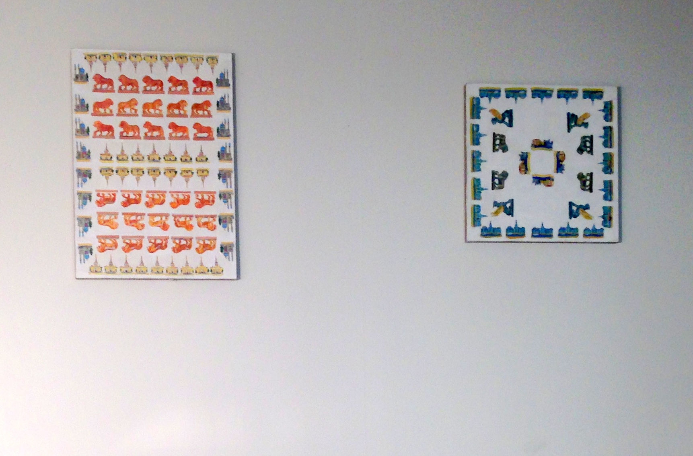
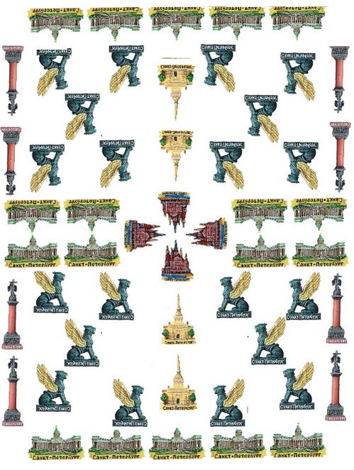
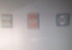

<h1>Painting</h1>

<h1>50X60, 45X45, 50X60, canvas, tempera, pencil</h1>

<h1>2015</h1>

<h6>Documentation of the exhibition on "24h" Corner Space, Helsinki</h6>

<h6>May, 2015</h6>

The work presents my contemplation and reflection on the situation with academic official supported arts and artists, "grew up" in the government academic environment in Russia today. 
During our stay in Helsinki we were asked by the question - whether there are markers that define the face of modern Russia, bearing in mind what is Alvar Aalto and Scandinavian design for Finland. I was

thinking about this issue. Of course, the history and culture of Russia is extremely rich, but for the country “Russian Federation” where we live now, to find the one obvious opinion will be difficult. In my canvases I try to answer this question and to reproduce an image, a reflection of the "official culture" of the last twenty years, with its kitsch, endless quotations, replicas and emphatically decorativeness. My canvas presents the series of endless copied souvenirs which I found in Saint Petersburg. I use a souvenir because it is a "trace touch to a single axis of urban memory." I'm trying to portray them on canvas with paranoid care, using academic method - infinite copying. Just as a student of the Academy of Fine Arts, I try to maximize identity with a given material, and do it completely irrational, as if his victim trying to prove that I am an artist.

<h2>COVER</h2>
