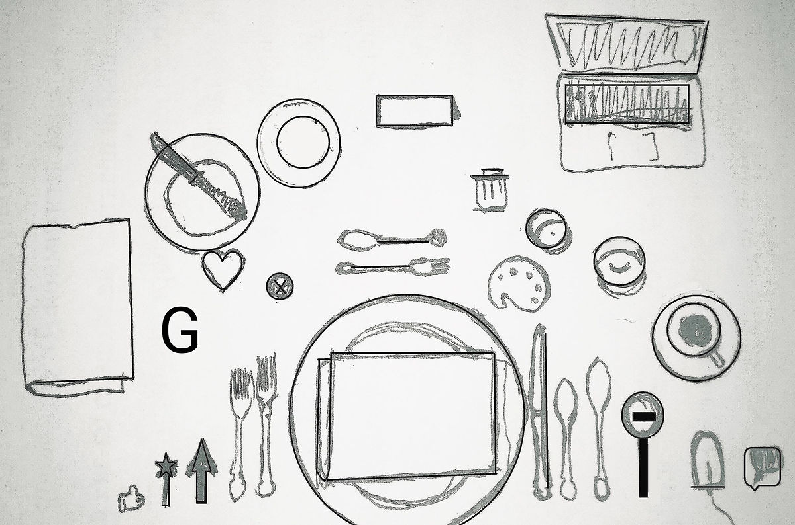

<h1>PROCARTISTINATION BRUNCHES</h1>

Procartistination Brunch is an event where, in a semi-professional semi-friendly atmosphere artists, curators,  interested  viewers  discuss articles, news, comments from the world of art at breakfast, passing into lunch.

The topic is everything that has appeared over the past week and what is interesting to talk about. For breakfast the organizers prepare a selection of links, texts, coffee and food. It is also an opportunity to get acquainted with the local space and share contacts with other participants of the community. 

The project studies the phenomenon of “structure of feelings” described by Raymond Wilms and identifies factors that form intangible values and components of the artistic and local community. The project uses the “breakfast” format as the most comfortable and convenient form of meetings in an informal setting.

Meetings are not documented or recorded, leaving the only visually accessible material - presentations that are used during discussions. They are collected and prepared on the basis of the subjective searches of the artist, and capture topics, conversations, excitement, memes, visual images that arise in the media and information field.

