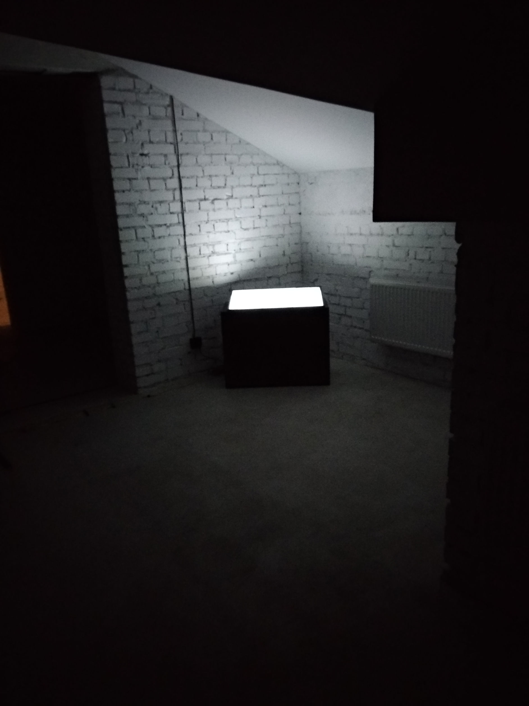
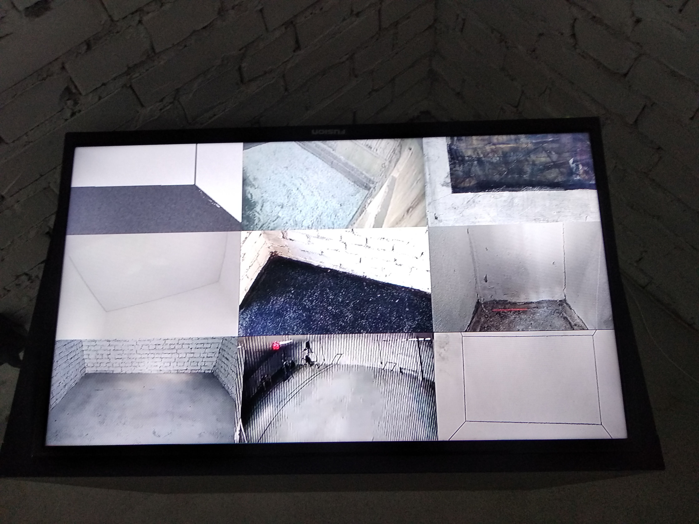

Вопрос пространства и формы получил разные значения в цифровую эпоху. Сегодня сложно сказать, что является пространством и формой выставки – белый куб галереи, мастерская художника или экраны смартфонов зрителей. Проект “Комнаты” пытается переосмыслить и реконструировать понятия пространства и формы выставки в цифровую эпоxу.

Экран транслирует видео с камер наблюдения, передающие изображения объектов в пространствах художника.

Экраны являются одновременно репрезентацией пространств вокруг объектов и самодостаточным объектом. Ретранслируя предметы и действия с камер наблюдения, комнат, рисунков, виртуальных пространств,  они создают их собственное пластическое представление в масштабе мониторов.

«Комнаты» являются гомогенной средой существования цифровых движущихся во времени изображений.

Проект создает пространство искусства вне координат и временных рамок. Репрезентация и ее рекурския являются основной формой и содержанием проекта.

<h1>Видео</h1>

<h1>7:00, без звука</h1>

<h1>2019</h1>

<h6>КОМНАТЫ</h6>
