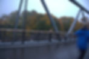
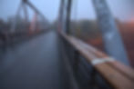

<h6>Performance in the form of city walk</h6>

<h6>2014</h6>

The topic of my project can be marked as the investigation of borders - personal borders, borders in communication, language, official borders of the country.

During my stay in Helsinki I was attracted by the railway bridge near the Central Station of Helsinki. I observed this bridge and found out that every day from early morning until late evening there are people who run and pass the bridge for different purposes. This railway bridge for visitors of the city represents some physical boundary, but for residents it is the quintessence of systematic space of the city, with its daily schedule and routes. On the bridge you can physically fit the systematization and the grid existed in the city, which I just visualize with my intervention. Observing the behavior of spectators in the installation we noticed, that the spectator always stops between created by myself marks of the grid, as he takes his cell. It asks the question – is the border something unnecessary, something from which you must get rid of, or it is a necessary requirement of the person. In the project I do not present any assessment, I just notice something that exists and can be felt, and visualize it. But I leave the choice and estimation to the spectator.

<h2>Experiments of space scaling  and researches of bridges</h2>
