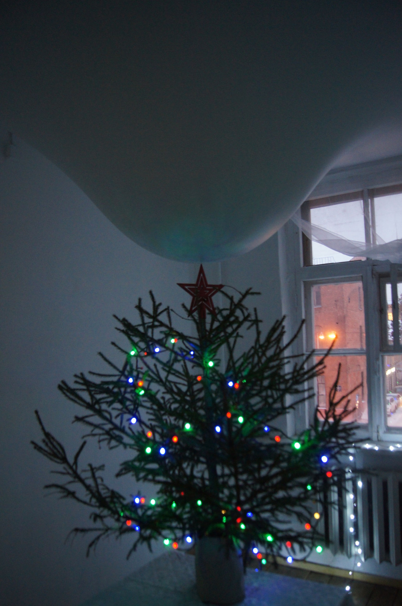
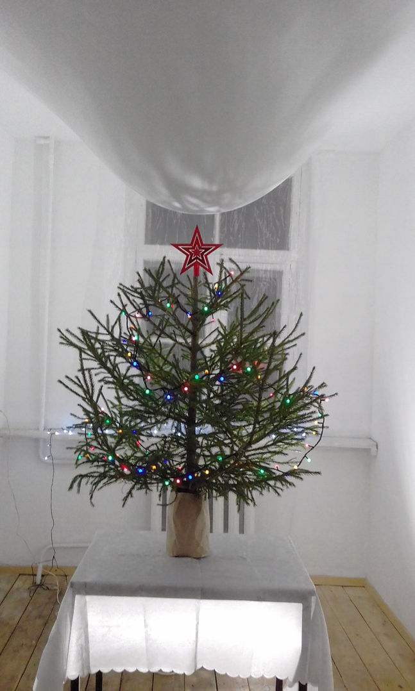
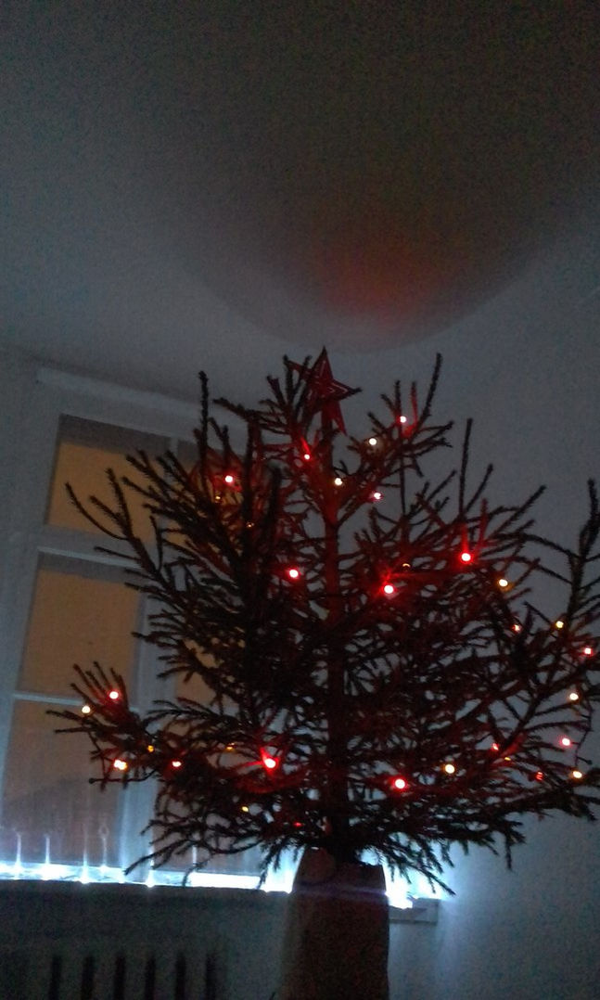
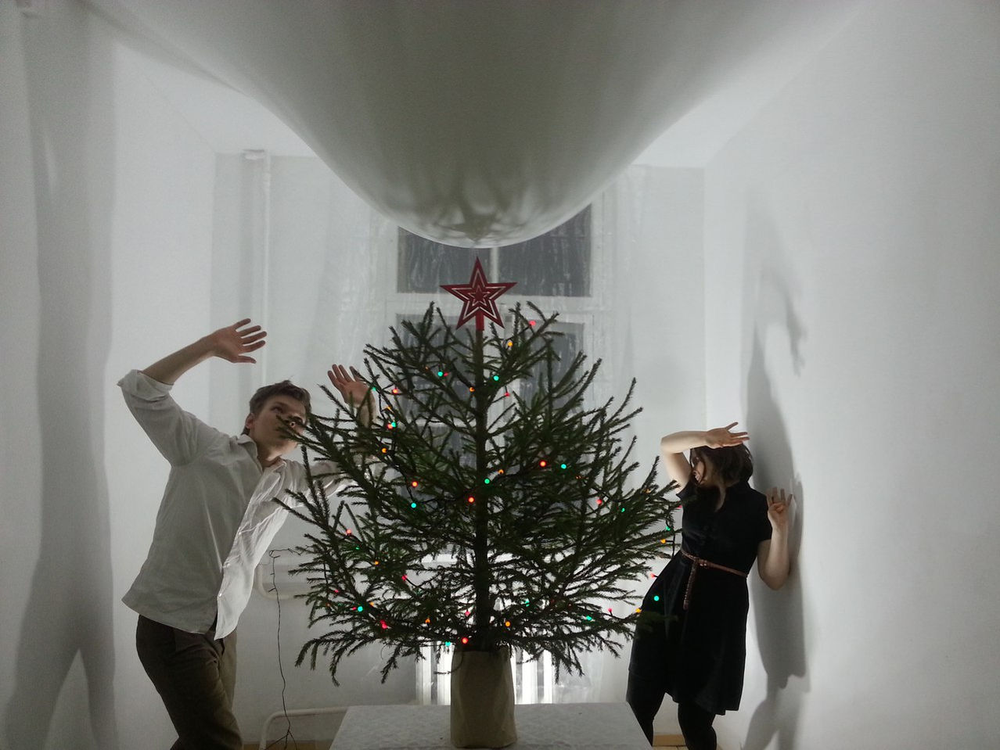

<h6>Инсталляция</h6>

<h6>2016</h6>

“Что-то новое” – это тотальная инсталляция, созданная в канун Нового года.

Устоявшиеся символы повторяющегося ритуала празднования Нового года –  елка, звезда, гирлянды, вступают в конфронтацию с нависающей массой потолка. Зрители, находящиеся внутри комнаты, чувствуют «состояние праздника», смешанное с тревогой  и страхом.

Инсталляция создает ощущение напряженности и неизвестности. Это метафора шизофренического состояния, в котором пребывает общество в эпоху надвигающегося кризиса.

<h6>Видео документация</h6>

<h2>ЧТО-ТО НОВОЕ</h2>
