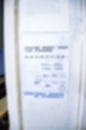
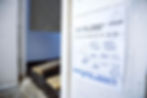
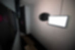

<h6>Total installation</h6>

<h6>7 mins</h6>

<h6>11 videos, wood, water, wood construction, glasses, mirrors</h6>

<h6>2019</h6>

<h6>Sometimes behave so stranglyis the theater installation formed from video sketches, sounds and poems. 
The action starts with the phrase “Sometimes behave so strangely” that music professor says  while demonstrating to the students the sound "Illusion of scale" observer by Diana Doitch. Caught in the technique of "found frames" and frozen in the "boomerang" sounds, images and actions echo, interfere, reflect and receive new connotations and contexts in the installation routes. The viewer, using a pause, repeating and reflecting, discovers that he was placed in a game with an increasing atmosphere  ofsuspense- a trap, playback and stop at the same time.</h6>

<h6>In this loop I find myself last either a couple of seconds, or thirty years. In an attempt to maintain balance on the wave of the flow of images and information, Icontemplatethis metastable neurotic state to the theory of media that act as mirror.</h6>

<h6>Interview about the exhibition</h6>

<h1>Documentation: walk through the exhibition</h1>

<h1>Photoshoot from Valeria Hope</h1>

<h6>SOMETIMES</h6>

<h6>BEHAVE</h6>

<h6>SO</h6>

<h6>STRANGELY</h6>

<h1>(C) <a href="http://www.nataliatixo.com">www.nataliatixo.com</a></h1>
