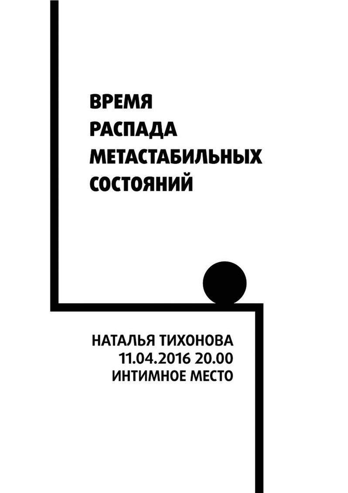
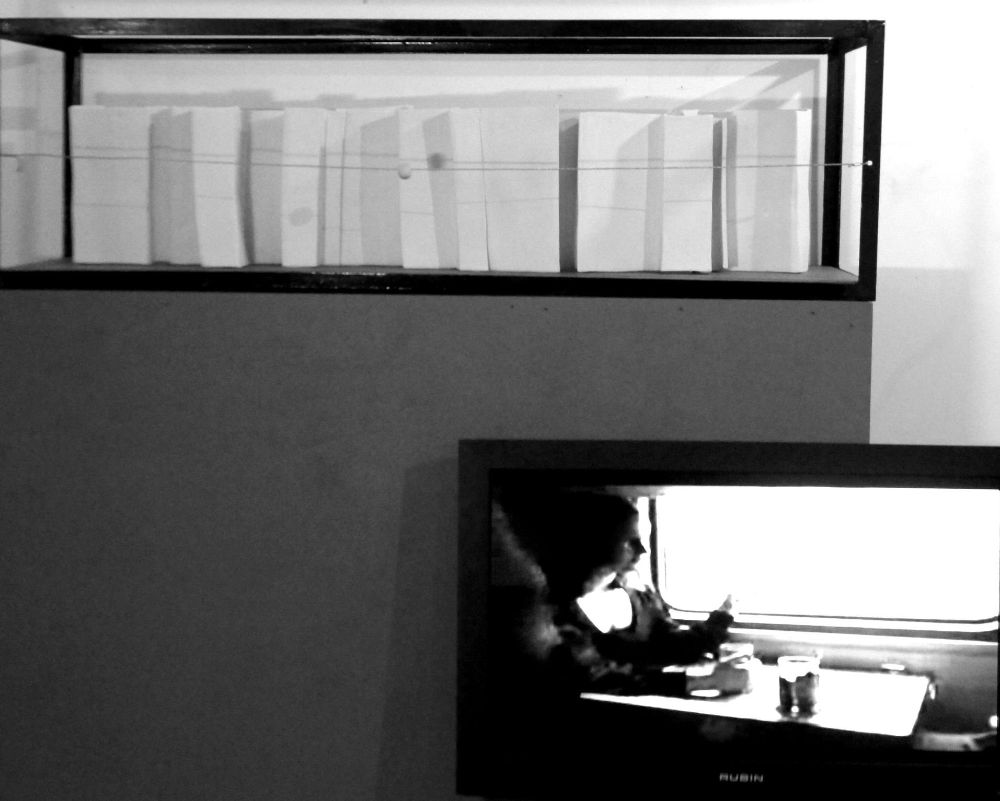
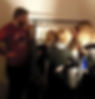

Main theme of the project  lays on the border between the abstract idea and its material embodiment.  
The project is based on a diploma Natalia performed  during her study on physics department. On the exhibition the scientific research takes shapes of  text, video and ceramic sculpture.  
Taking theory of physics as pure abstraction, Natalia doesn't simplify science work for the audience. In contrary of that she proposes to consider the physical investigation as an artwork. Ceramic sculpture is not able to illustrate an abstract concept, and, passing through the requirements of the plastic and artistic language, it makes the understanding of science work more complicated. Focus of the viewer switches from the material object of the sculpture to the non-material processes described in video. The flats of the visual and abstract concepts intersect and form new space - mathematical calculations start to take forms of political, artistic and aesthetic expression. 
Investigation of paradox becomes a unifying element between art and science.

<h6>Video</h6>

<h6>Documentation of the exhibition on Labradory "Intimate space"</h6>

<h6>Saint Petersburrg</h6>

<h6>April, 2016</h6>

<h6>Installation</h6>

<h6>ceramic, metallic contrustion, video 3:25</h6>

<h6>2016</h6>

<h2>THE DECAY TIME</h2>

<h2>OF METASTABLE STATES</h2>
