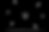
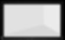
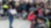
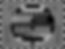

<a href="https://syg.ma/@natalia-tikhonova/onlain-platformy-kak-ghibridnyie-formy-vystavok-vstuplieniie-pro-uslovnost?fbclid=IwAR0t2BU9uZFv8Ub3Pco8a9uJL7cgeHQIas7qjZHppUoShwZGF-Z85Hg12tg">https://syg.ma/@natalia-tikhonova/onlain-platformy-kak-ghibridnyie-formy-vystavok-vstuplieniie-pro-uslovnost?fbclid=IwAR0t2BU9uZFv8Ub3Pco8a9uJL7cgeHQIas7qjZHppUoShwZGF-Z85Hg12tg</a>

Introduction, "On Convention"

<em>I am an artist, curator, and media researcher, and this essay began when, in 2019, I defended a master's thesis on strategies for creating exhibitions and events in the format of online platforms. In 2020 I started telling students at the Paideia school about the discoveries I'd made among online platforms, and then the coronavirus intervened and canceled events and travel, sitting everyone down at their computers, so I thought it made sense to publish the material in an agile mode.</em><em>This text is an introduction, to be followed by four parts transcribing meetings — on historical narrative, redefining the concepts of exhibition, gallery, and museum, hybridity, and the strategies and references of exhibitions in the format of online platforms. At first I just wanted to sum up how this field had developed as of 2019, but it seems to have turned into something more personal and public, about a state of frustration and oscillation that has united art, politics, and life.</em><em>Many thanks to Marina Russkikh for editing and to Natalia Fedorova for her patronage.</em> 

I'm interested in unstable, metastable states, which I study one way or another both in my own artistic work and in my texts and research. The format of exhibitions and projects that use websites, blogs, and social media interests me as an example of practices that are unstable in their very form, working in a "gray zone." Online documentation, blogs, Telegram channels, network performance, archive, website — all of this can be called practices of information art, which can be gathered under the umbrella term "online platforms."The influence of art presented online — and its sheer quantity as well — is so great that it can't be ignored, and I'm being somewhat ironic starting with that phrase. When the traditional form of an exhibition, marked by an address on a map, doesn't meet the tasks set for it — encapsulating information or creating communication — the format of internet platforms can turn out to be more suitable: various kinds of online exhibitions, galleries, festivals, and biennials arise. Other directions of internet art — tactical media, media activism, educational projects — have also become an important offshoot of conceptual and relational art. Online platforms — websites, blogs, social media — have become a new form of interaction and communication, creating their own visual language and conceptual constructs.Today, artists and curators, unlike artists of <a href="https://ru.wikipedia.org/wiki/%D0%9D%D0%B5%D1%82-%D0%B0%D1%80%D1%82?utm_referrer=https://syg.ma">net art</a> and <a href="https://ru.wikipedia.org/wiki/%D0%9F%D0%BE%D1%81%D1%82-%D0%B8%D0%BD%D1%82%D0%B5%D1%80%D0%BD%D0%B5%D1%82_%D0%B8%D1%81%D0%BA%D1%83%D1%81%D1%81%D1%82%D0%B2%D0%BE?utm_referrer=https://syg.ma">post-internet</a>, don't divide the space in which their work exists into "online" and "offline." The network is everywhere, and it has become such a widespread material and medium that the definition "art that exists online" has lost its meaning, because today it's hard to find anything that exists outside the network. We don't divide the world into online and offline: both have become sides of the same surface we all live on. Everything and everyone is online. Internet art today (and therefore all art) has a different structure and different motives, and rather continues the traditions of artists whose main task was to displace political and social processes and hierarchies (Situationism, telematic practices, institutional critique, land art, street art). 

Still from the video "I'm net artist" by area3.netIf back in the early 2000s net art still looked like an experimental direction that, at the peak of its development, could make it into a museum and finally receive legitimate recognition there as "high art," today we see that net art no longer needs that kind of "approval" from "big brother." "The student has surpassed the teacher": the space of the internet today is far bigger than anything a museum can offer. Unlike tactical media or net art, "art on the internet," or "internet art," developing today on the basis of online platforms, works with a far broader field, having continued and merged in its own practice both their strategies and the strategies of museum and gallery exhibition spaces. 

In my view, the processes defining the development strategies of art based on online platforms (and therefore, following my reasoning, of practically all art) are described by <a href="http://moscowartmagazine.com/issue/64/article/1349?utm_referrer=https://syg.ma">Claire Bishop's 2015 text "Black Box, White Cube"</a> — but from the opposite side. The article is devoted to analyzing the trend of showing dance-based exhibitions in museums and galleries. Performances lasting 2, 4, or 8 hours work directly with modes of the human condition oscillating between attention and distraction, private and public.Bishop calls the state in which contemporary humans spend most of their time a "gray zone," meaning the constant oscillation of the subject's attention between the personal and the social. In the case of information wars and precarious labor, control over attention is an important task for totalitarian structures and productive capitalism. Speaking of the borderline format of the exhibition-as-spectacle, the researcher stresses that it is "not simply a non-reflexive replication of the neoliberal world in which it [the museum] flourishes, but tells us a great deal about the changing nature of spectatorial perception." 

J.D. from the series "Scrubs"People have always existed in a state of constant switching between modes of distraction and concentrated attention, which is beautifully visualized, for example, in the series <a href="https://ru.wikipedia.org/wiki/%D0%9A%D0%BB%D0%B8%D0%BD%D0%B8%D0%BA%D0%B0_(%D1%82%D0%B5%D0%BB%D0%B5%D1%81%D0%B5%D1%80%D0%B8%D0%B0%D0%BB)?utm_referrer=https://syg.ma">Scrubs</a>, when its hero J.D. slips into comic states of fantasy while at work. Claire Bishop stresses that in everyday life these switches have moved to the foreground because of the mobile revolution, the ubiquitous spread of gadgets. If the show were set today, the character wouldn't need to tilt his head back to sink into his daydream world — it's enough to open a messenger app on his phone under the table during a meeting.Exhibitions in the format of online platforms, working in online and offline space at the same time, use the discourse of "attention" as an artistic device and a political gesture. This property of space makes it possible to work with the materiality and temporality of the exhibition, not simply copying an offline gallery, but creating new strategies — hybrid forms of exhibitions, extended spectatorship, "slow curating."The principle of oscillation and a borderline state can be applied to the phenomenon of the exhibition in general, where, on the one hand, we have some event or action happening with concrete subjects and objects, and on the other, immaterial informational waves that make up no smaller a part of the exhibition: documentation, conversations, context, notes and photographs in blogs. Any presentation in the format of an online platform also easily fits into this series.This definition uses the principle of <a href="https://ru.wikipedia.org/wiki/%D0%9A%D0%BE%D1%80%D0%BF%D1%83%D1%81%D0%BA%D1%83%D0%BB%D1%8F%D1%80%D0%BD%D0%BE-%D0%B2%D0%BE%D0%BB%D0%BD%D0%BE%D0%B2%D0%BE%D0%B9_%D0%B4%D1%83%D0%B0%D0%BB%D0%B8%D0%B7%D0%BC?utm_referrer=https://syg.ma">wave-particle duality</a> in physics, according to which light is at once both a particle and a wave; in the same way, an exhibition is at once both an event at a geographic point and an informational trace existing in conversations, the press, blogs, and so on. 

The theory of "the relativity of the exhibition" makes it possible to link the online platform to the traditional idea of an exhibition at a geographic point, folding into it both context and response to the immediate event (which is often no less important for the perception of art), and projects that work with media and information, like the projects of <a href="https://en.wikipedia.org/wiki/The_Yes_Men?utm_referrer=https://syg.ma">The Yes Men</a>, the <a href="https://syrianarchive.org/?utm_referrer=https://syg.ma">Syrian Archive</a>, and others like them.The viewer's oscillation between the personal and the public, the general and the particular, the invented and the real, existed before as well, but today, with the ubiquitous spread of the internet and mobile phones, artists and curators have begun to articulate and conceptualize this phenomenon. By slowing the speed at which information travels, the internet created new spaces and temporalities: separating distance from proximity, time from duration. Since it's impossible to limit the space of an exhibition's action to a web address on the network or the walls of a gallery, it turns out to be blurred not only in time and place, but in its very materiality, while still retaining its contextuality. The place of action — the address — is still determined by the algorithm, the road, the chain of signs that led the viewer to the exhibition or event, whether a physical or an online gallery. Just as a museum exhibition can make use of the viewer "dropping out" during the viewing process, artists and curators using online platforms can, with equal success, fold non-online context into the space and concept of their exhibitions.I started discussing my "special theory of relativity of the exhibition" — the way stand-up comics try out material — with the people close to me, with theorists friendly to me, and a natural question arose. In the case where we're talking about the extreme point (the point of extremum) of an exhibition existing only in the format of an online platform, that is, an "informational wave," can we speak of the formation of a "political body"? After all, one of the important characteristics of an exhibition or a project is its potential to form a "political body" as a result of joint action, shared experience, a shared state — the very thing <a href="https://discours.io/articles/chapters/dzhudit-batler-zametki-k-performativnoy-teorii-sobraniya-telesnost-demokratii-i-dostoynaya-zhizn?utm_referrer=https://syg.ma">Judith Butler writes about</a>. On what plane can we speak of a "political body" in the case of an online platform, unfolding in an informational field scrubbed clean of corporeality?The merging of offline and online realities stopped being even remotely interesting or relevant as a philosophical discourse a long time ago — as already said, they are two sides of the same sheet. Starting in 2012, the state has confidently answered the question of the "virtuality of the virtual," assigning actions online a weight that is maximally real and incontestable in its corporeality, <a href="https://www.svoboda.org/a/28943937.html?utm_referrer=https://syg.ma">in the form of restrictions on freedom</a> — a gesture that strips away political will and the political body. In the post-Soviet space, the schizophrenic processes that Soviet citizens constantly talked about — a double life, kitchen-table conversations — would seem to have gone into the past, but at the same time they flicker ghost-like in Russian reality, turning into an article of the Russian Criminal Code <a href="https://www.forbes.ru/tehnologii/369439-srok-za-repost-skolko-v-rossii-osuzhdennyh-za-deystviya-v-internete?utm_referrer=https://syg.ma">on punishments for thoughtcrimes</a>, which has acquired a new technological shell.Today's view of technology is important to distinguish from the modernist idea of "<a href="https://www.livelib.ru/book/1000452347-proizvedenie-iskusstva-v-epohu-ego-tehnicheskoj-vosproizvodimosti-valter-benyamin?utm_referrer=https://syg.ma">its own destruction as an aesthetic pleasure of the highest order</a>" — artists understand the political potential of technology and its innovative, revolutionary properties, but aren't afraid of being destroyed by it, since they feel themselves to be part of technology. By 2020, the fear of being left behind by history and destroyed by the ideally engineered wheel of technological progress has receded, but it's been replaced by new anxieties and strategies, at the base of which lie political and social processes — and therefore also a "critical adaptation of technological innovation." 

In recent years the number of resources like Navalny's Telegram channels, the Golos website, Memorial, and Mediazona has been growing, creating a rhizomatic network of thousands of virtual signatories who alternately hide and present their bodies at elections, actions, trials, and rallies. Media activism has become a legitimate strategy and practice of struggle. The protest that <a href="https://garagemca.org/ru/publishing/judith-butler-notes-toward-a-performative-theory-of-assembly-by-judith-butler?utm_referrer=https://syg.ma">Butler</a> appeals to is impossible not only without presenting the body on the street, but also without presenting a photograph of the body/bodies on social media or in the press.Starting in 2008, these worlds — the virtual, black, and the real, white — have gone deeper and deeper into one another and interwoven with each other, existing in a space that is disembodied but affective.

Continuing to amplify the oscillation between black and white, virtual and real, which alternately weave into each other and increase the distance between them, trying to find mechanisms of control over algorithms, hierarchies, power, the state, we fall into a zone of ever-greater blending of the mental and the corporeal, the natural and the mechanical, the private and the political, the human and the digital. It's in this flickering mode, now presenting the body, now turning it into informational waves, that we exist today.I spent a long time trying to find a precise term for this regime of oscillation and metastability. And once again the media landscape threw up the most fitting term, reporting on the suspended sentence given to one of the central figures of the Moscow Case: <a href="https://www.interfax.ru/chronicle/delo-egora-zhukova.html?utm_referrer=https://syg.ma">"suspended."</a>In suspended time and suspended space, suspended art fills suspended museums and galleries, suspended students go to suspended universities, suspended city-dwellers go to suspended jobs, a suspended state suspendedly governs a suspended country — the Gray Zone, in which we suspendedly live.Today, on the one hand, the virus drives us into our apartments, increasing the materiality of the virtual; on the other, the state drives us out onto the streets, confirming the virtuality of the material.The flickering intensifies.

 

A monitor's screen-flicker test

