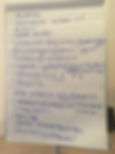
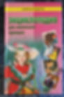
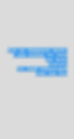
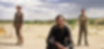

<a href="http://aroundart.org/2020/05/20/30-marta-12-maya/?fbclid=IwAR3qVcoZ4mP8YqD3oA7OLjWvwFb6g_cQeJetwcUDZ1s8k1HTuPWGi1MHf1c">http://aroundart.org/2020/05/20/30-marta-12-maya/?fbclid=IwAR3qVcoZ4mP8YqD3oA7OLjWvwFb6g_cQeJetwcUDZ1s8k1HTuPWGi1MHf1c</a>

"Spravochnik" ("The Handbook") is a project initiated by independent curators — Tatiana Kiryanova, Ekaterina Sokolovskaya, and me, Natalia Tikhonova — with the support of GTsSI in Saint Petersburg. <a href="https://spbart.atlassian.net/">"Spravochnik"</a> is a platform for exchanging information, opinions, and help, filled in on a "wikipedia" principle by curators, participants, and anonymous users.

"Spravochnik" runs on <a href="https://ru.wikipedia.org/wiki/Confluence">Confluence</a>, a system used in the IT industry to build internal corporate documentation. In cases where the information is open to all users, Confluence's makers provide their resources for free. 

<a href="http://aroundart.org/wp-content/uploads/2020/05/1.png">"Spravochnik" on Confluence</a> 

<a href="http://aroundart.org/wp-content/uploads/2020/05/1.png">The idea to create "Spravochnik" came up in February 2020. That winter we came to GTsSI in Saint Petersburg with a proposal to organize meetings for artists and curators on neutral ground, without a set script or moderation — something close to a hobby club, where you could meet informally and discuss problems that mattered and worried us — to set off a process close to "circulation." So we agreed to gather twice a week for meetings we called</a> <a href="https://www.facebook.com/events/223628192375173/">"Natural Circulation."</a> By the way, we argued for a long time about whether to call the meetings "natural" or "artificial," or just "circulation," but decided to cut out the unnecessary puns.

<a href="http://aroundart.org/wp-content/uploads/2020/05/2-1.jpg">A secret poster for the first meeting. Author: Natasha Khvoenkova</a>

<a href="http://aroundart.org/wp-content/uploads/2020/05/2-1.jpg">For the first, test meeting we invited curators and artists we knew and didn't know, and suggested thinking about the format and theme of future events, given that we'd be taking on the role of curators, while GTsSI would help us organize the project with informational support and by sharing its symbolic capital. During the first meeting nothing exactly unexpected happened to us, but it confirmed that it's simply impossible to pin down either a meeting format or common themes that would satisfy the needs of every member of the community.</a>

<a href="http://aroundart.org/wp-content/uploads/2020/05/2-1.jpg">Moodboard from the first meeting</a> 

<a href="http://aroundart.org/wp-content/uploads/2020/05/2-1.jpg">The proposals were maximally diverse in their ambitions and scale — from the need to create, or at least start drafting, a union charter, to launching infrastructural changes, to requesting access to information — consultations with lawyers, crisis managers, designers, architects, psychotherapists — all the way to simply wanting to gather and chat over tea/coffee/beer in an informal setting.</a>

 

<a href="http://aroundart.org/wp-content/uploads/2020/05/2-1.jpg">A reference point for "Spravochnik"</a>

<a href="http://aroundart.org/wp-content/uploads/2020/05/2-1.jpg">After the first meeting we took a month's pause.</a>

<a href="http://aroundart.org/wp-content/uploads/2020/05/2-1.jpg">After some reflection and discussion, we concluded that even though the art community is fragmented, everyone is, one way or another, united by a shared state of confusion, disconnection, lack of information, and lack of care. So we came up with the idea that the axis around which such meetings and conversations could be built might be the idea of creating, or writing, a "Handbook for curators, artists, and all members of the art community." That way, in the process of making it, we could discuss practical, ethical, philosophical, and other emerging topics, while filling "Spravochnik" with useful information along the way.</a>

<a href="http://aroundart.org/wp-content/uploads/2020/05/2-1.jpg">From Natalia Tikhonova's project "Advice to an Artist in Twelve Insta-Stories"</a> 

<a href="http://aroundart.org/wp-content/uploads/2020/05/2-1.jpg">Of course, the idea of creating "Spravochnik" is utopian, just like the idea of creating meetings free of institutional approach and moderation, or the possibility of giving out any advice, or rules for life/survival.</a> <a href="http://aroundart.org/wp-content/uploads/2020/05/2-1.jpg">But still, we hope the "forum" can articulate problems tied to the industry, embody ideas of mutual exchange — of knowledge and resources — and create additional possibilities for communication through critique of the industry and its institutions.</a>

<a href="http://aroundart.org/wp-content/uploads/2020/05/2-1.jpg">"Spravochnik" is a project where many approaches developed by artists and curators come together:</a> 

<a href="http://aroundart.org/wp-content/uploads/2020/05/2-1.jpg">— online platforms as an exhibition venue for communication;</a><a href="http://aroundart.org/wp-content/uploads/2020/05/2-1.jpg">— pedagogy as an artistic strategy;</a><a href="http://aroundart.org/wp-content/uploads/2020/05/2-1.jpg">— possibilities for relationships through critique of the art system;</a><a href="http://aroundart.org/wp-content/uploads/2020/05/2-1.jpg">— an attempt to create forms not labeled as art.</a> 

<a href="http://aroundart.org/wp-content/uploads/2020/05/2-1.jpg">A project existing in "wikipedia" format is a synthesis of "relational aesthetics" and technological art, focused on a property of technology — the internet as medium.</a><a href="http://aroundart.org/wp-content/uploads/2020/05/2-1.jpg">On the whole, using technology to exchange and create communication already has a long history: at the dawn of the internet, among engineers — FIDO, the free software movement; among artists — net art and tactical media. Online platforms, besides</a> <a href="http://panthermodern.org/">the search for a new visual language</a>, and <a href="https://www.tate.org.uk/whats-on/tate-modern/performance/bmw-tate-live-2013-performance-room">the creation and determination of affective states</a>, are also used today by artists, curators, and media activists for their "direct purpose" — as <a href="https://monoskop.org/">databases</a>, <a href="http://www.laboriacuboniks.net/">archives</a>, <a href="https://awarewomenartists.com/">forums for declaring</a>, disseminating, and storing their manifestos, projects, political gestures. 

<a href="http://aroundart.org/wp-content/uploads/2020/05/6.jpg">Still from the film "Oil," 2007</a> 

<a href="http://aroundart.org/wp-content/uploads/2020/05/6.jpg">One might suppose that, in this respect, it's easier for projects to encapsulate themselves in the online environment if they make use of its main property — the ability to create communication and exchange. Despite the fact that "Spravochnik" was conceived without any relation to a "self-isolation" regime, it's interesting for us to trace how it will fold into the existing environment, whether it can become a working model and find practical application, or whether it will simply remain in the field of theories, intentions, and questions:</a>

<a href="http://aroundart.org/wp-content/uploads/2020/05/6.jpg"><em>Is it possible to create a project within the neoliberal logic of art that isn't burdened by financial or symbolic capital?</em></a>

<a href="http://aroundart.org/wp-content/uploads/2020/05/6.jpg"><em>When creating a project that calls for "mutual aid," how do you avoid the gap between the marketing strategy of "mutual aid" and its real-world realization?</em></a>

<a href="http://aroundart.org/wp-content/uploads/2020/05/6.jpg"><em>If the entire art business has hit pause, can we talk about a new temporality for curators, artists, viewers?</em></a>

<a href="http://aroundart.org/wp-content/uploads/2020/05/6.jpg"><em>Will online make it possible to use the principles of "slow curating" — building projects around their own processuality and a more attentive relationship between artist-curator-art-milieu-viewer?</em></a>

<a href="http://aroundart.org/wp-content/uploads/2020/05/6.jpg"><em>Can we talk about a global tendency toward unification and support, and about reassembling models of interaction within the art community?</em></a>

<a href="http://aroundart.org/wp-content/uploads/2020/05/6.jpg"><em>Has the Russian art community turned out to be ready for a turn toward solidarity and unification?</em></a>

