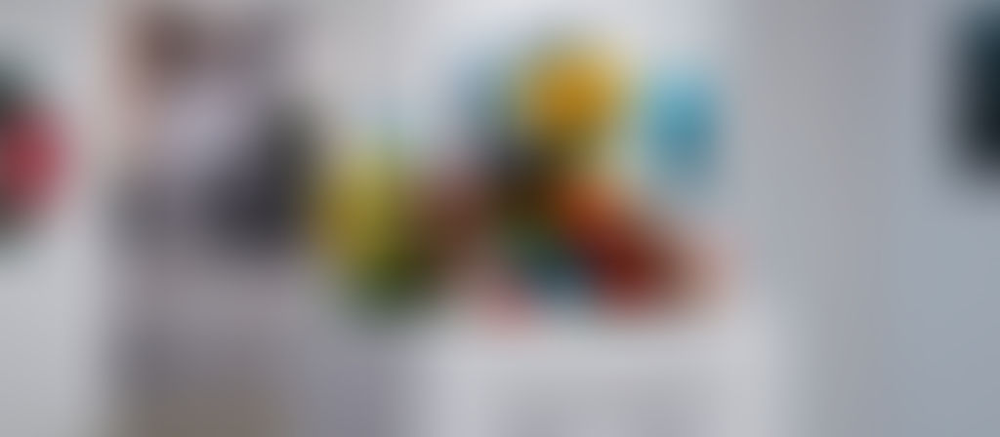

<a href="http://aroundart.org/2020/04/13/otkrytia_okyabr-fevral/?fbclid=IwAR3GQvSkijnYA__IAimlSw50eiYWvn-SNxs12V2K1-U0aP311B9wU855iaY"><strong>Read the article on aroundart.org</strong></a>

In November, a new point appeared on Petersburg's sparse but dense cultural map — ZGA gallery, founded on the basis of the "Dokdokdok School of Contemporary Photography." The exhibition space is oriented toward presenting conceptual photography and the school's graduates, which gives hope for expanding the boundaries of the contested definition of "Petersburg art." The gallery's first exhibition was the project "Horror. You Are Here" by artist Tata Gorian — a member of the group iBiom Box, a graduate of the "Dokdokdok" school, ISSP, and the Alexandrinsky Theatre's "New Media Lab."

Tata's photographs, installations, and media performances, drawing on technocratic, anthropological, and even "bacterial" methods, study aspects of the interaction between humans and nature, switching between micro- and macro-optics.

The project "Horror. You Are Here," like a matryoshka doll, consists of two parts and balances between installation and photography. The first part consists of the photo series Copypaste, where Tata photographs plastic "natural objects" — tablecloths, film, artificial flowers, and prop fruit — and observes "how a person living in a technocratic world keeps recreating nature inside and outside the home." This drops us into an endless, paradoxical cycle of representations: nature — an imitating object — a photograph — an installation — a gallery — a viewer — a text — a reader of the review.

At the project's second stage, the artist packs the photo series into the space of a total installation, where, having finished the photo project, she keeps reflecting on what will happen to the materials after the shoot. The making of a photograph doesn't end with presenting a flat image: at the center of the installation the artist places a basket with materials used in the shoot, along with options for methods of destroying plastic.

If photography, in trying to recreate the surrounding environment out of artificial materials, strives toward the "immortality" of nature, then in the second part — the installation in the white cube — the artist tries to find ways to end this ongoing "immortality" and find a way to dispose of the traces left over after the shoot.

Tata stresses that while working on the exhibition she drew inspiration from a research project by a group of scientists on ways insects and bacteria recycle plastic, where she was struck by how humanity's drive to construct objects and exert control turned out to be absorbed by nature. Since, from "today's" vantage point, the scientists' theories and recycling methods look utopian and unrealistic — like an image of a distant future that hasn't happened yet — the artist finds herself at a point of waiting, uncertainty, and anxiety.

Among the photographs in the exhibition there is one non-flat element — a curtain, imitating a door. Also, having offered the viewer a choice of ways to recycle the waste of their own cultural production, the artist speaks of the absence of any working mechanisms, and, accordingly, the absence, in the near future, of any alternative to a permanent coexistence with plastic and with garbage, and "even death will not part us." From reflections on the nature of photography, the artist arrives at recognizing herself as an actor in the ecological crisis.

I, as an artist, ask myself the same questions — can art, being toxic and, let's be honest, not the most utilitarian kind of production, redirect its vector toward objectlessness and not increase its ecological footprint — or, which seems even less realistic, reduce it?

First and foremost, the exhibition speaks about the artist's responsibility, and about the materiality and toxicity of art, rather than about the mimetic nature of photography or the looming ecological catastrophe which, as Feodora aptly notes in the curatorial text, is today being popularized and hollowed out by mass culture. An action carefully documented and shown in the white cube presents a frozen safety in a lifeless, but not immortal, form, which in 2019 there's no way to hand in for recycling. The attempt to dispose of/legitimize the objecthood of art in an exhibition format amounts to the production of artificial flowers. Ignoring this fact leads to a growing horror, and all that's left is to freeze at this relative point of equilibrium, oscillating from the possible to the real, from thought to action, from catastrophe to calm.

The answers, it seems to me, are contained in the exhibition's title — specifically in the gaps, which can become a cipher-key for every viewer.

Where — here? On Earth? In the gallery? At the exhibition?You are here?You are here!You (who)? Are (how)? Here (where)?!..

And, as my text-editing program suggests to me, "'are' is a weak verb, denoting a state rather than an action. Try removing it or replacing it with an action verb."

